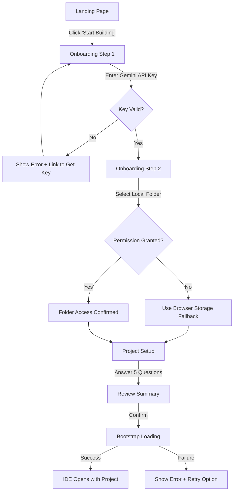
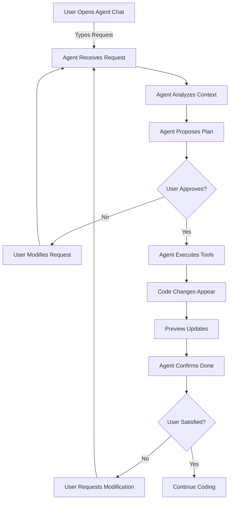
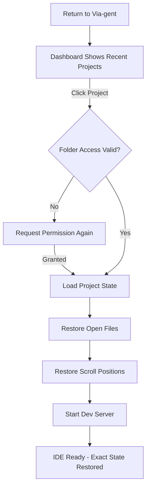

# Via-Gent UX Design Specification

> **Browser-Based AI-Powered IDE for Full-Stack Development**

---

## Executive Summary

### Project Vision

Via-gent is a browser-based IDE where AI agents and human developers collaborate on full-stack projects without any server infrastructure. Projects are scaffolded, coded, tested, and deployed entirely within the browser, persisted to the user's local machine via the File System Access API.

**Core Value Proposition:** Skip hours of boilerplate setup—Via-gent's coordinator agent asks 5 questions, then bootstraps a production-ready TanStack Start project with your chosen features running live in your browser within 2 minutes.

### Target Users

#### Primary: "Alex the Solo Full-Stack Builder"
- **Demographics:** Age 25-35, freelance developer or indie hacker
- **Skills:** Intermediate JS/TS, knows React basics
- **Pain Points:** 
  - "Setting up a new project takes 2 hours"
  - "I want AI assistance but don't want $20/month subscriptions"
  - "Projects break when switching computers"
- **Success Metric:** Ship a working MVP in <1 day instead of <1 week

#### Secondary: "Jordan the AI-Curious Learner"
- **Demographics:** Age 18-24, student or bootcamp grad
- **Skills:** Basic HTML/CSS, minimal JavaScript
- **Pain Points:**
  - "I don't know how to set up a dev environment"
  - "Following tutorials, half the commands fail"
- **Success Metric:** Build first full-stack app within first week

#### Tertiary: "Taylor the Workshop Instructor"
- **Demographics:** Age 30-45, educator or course creator
- **Pain Points:**
  - "Half my workshop time is lost to npm install errors"
  - "Students have different OS/versions"
- **Success Metric:** Zero time spent on environment setup

### Key Design Challenges

1. **Zero-Friction Entry:** Users must go from landing page to productive coding in <3 minutes without installation
2. **AI Transparency:** Users need to understand and control what agents are doing at all times
3. **Dual File System Complexity:** Managing sync between browser memory (WebContainers) and local disk (FSA API) invisibly
4. **Multi-Agent Coordination:** Making multiple specialized agents feel like a coherent, helpful team
5. **Desktop IDE in Browser:** Achieving professional IDE functionality within browser constraints

### Design Opportunities

1. **Conversational Project Setup:** Transform complex configuration into friendly Q&A dialogue
2. **Live Preview Magic:** Instant visual feedback creates "wow" moments for users
3. **Agent Transparency as Feature:** Turn AI explainability into competitive advantage
4. **Local-First Trust:** Privacy-respecting architecture as key differentiator

---

## Core User Experience

### Defining Experience

**"Ask AI, See Code, Watch It Run"**

The defining experience is the moment when a user asks the AI agent for a feature ("Add a contact form"), watches the agent explain its plan, sees code appear in the editor, and immediately sees the working feature in the live preview—all within 10 seconds. This cycle of **Request → Plan → Execute → See** is what makes Via-gent magical.

**User Story:**
> "I told Via to add a dark mode toggle, and I literally watched it create the component, wire up the state, and suddenly my preview had a working toggle. It felt like having a senior developer pair programming with me."

### Platform Strategy

**Primary Platform:** Desktop browsers (Chrome 86+, Edge 86+, Safari 15.2+)
- Full File System Access API support for Tier 2 persistence
- WebContainers require modern browser capabilities
- IDE requires desktop viewport (minimum 1024px width)

**Tier 1 Fallback:** Firefox 115+ (IndexedDB only, no local file persistence)

**Not Supported:** Mobile browsers (IDE requires desktop viewport)

### Effortless Interactions

1. **Project Creation:** Answer 5 simple questions → Complete project scaffolded
2. **File Editing:** Edit code → Auto-save (2s debounce) → Preview hot-reloads
3. **AI Assistance:** Type request → Agent explains plan → Changes appear with diff highlights
4. **Local Sync:** All changes automatically sync to local folder → Open in VS Code anytime
5. **Deployment:** One click → Build runs → Live URL generated

### Critical Success Moments

| Moment | Success Indicator | Failure Indicator |
|--------|-------------------|-------------------|
| First Visit | User understands value in 30s | User bounces immediately |
| Onboarding | API key + folder permission in <2min | User abandons at permission step |
| First Project | Sees live preview within 2min | Bootstrap fails or times out |
| First AI Request | Agent makes useful change | Agent produces broken code |
| Return Visit | Project resumes exactly where left off | State lost or corrupted |

### Experience Principles

1. **Progressive Complexity:** Start simple, reveal advanced features on demand
2. **Immediate Feedback:** Every action produces visible response within 2 seconds
3. **Recoverable Errors:** Every mistake is undoable with clear recovery path
4. **Transparent AI:** Users always know what agents are doing and why
5. **Local-First Trust:** Data stays on user's machine, explicitly communicated

---

## Desired Emotional Response

### Primary Emotional Goals

| Emotion | How We Create It |
|---------|------------------|
| **Empowered** | Users accomplish tasks they thought were beyond their skill level |
| **In Control** | AI explains before acting, changes are reviewable and undoable |
| **Delighted** | Moments of "magic" when preview updates instantly |
| **Confident** | Clear feedback confirms actions are working |
| **Trusting** | Transparent about data handling, no hidden uploads |

### Emotional Journey Mapping

```
Discovery → Curiosity ("This looks interesting")
    ↓
Onboarding → Anticipation ("Let's see if this works")
    ↓
First Success → Delight ("Wow, it actually works!")
    ↓
Learning → Growing Confidence ("I'm getting good at this")
    ↓
Mastery → Pride ("I built this myself")
    ↓
Return → Comfort ("This is my tool")
```

### Micro-Emotions

**Confidence vs. Confusion**
- Every action has clear feedback
- Error messages explain what went wrong AND how to fix
- Progress indicators for all long-running operations

**Trust vs. Skepticism**
- Show exactly what files agent will modify before executing
- Clear diff views for all code changes
- "Your data never leaves your device" messaging

**Accomplishment vs. Frustration**
- Celebrate milestones (first project, first deploy)
- Save state frequently to prevent lost work
- Graceful degradation when features unavailable

### Design Implications

| Emotion | UX Design Approach |
|---------|-------------------|
| Empowerment | Agent proposes solutions, user approves |
| Control | Review/approve flow before AI changes |
| Delight | Smooth animations, instant preview updates |
| Confidence | Success states, progress indicators |
| Trust | Transparent data handling messaging |

### Emotional Design Principles

1. **Celebrate Success:** Visual confirmation when things work
2. **Cushion Failures:** Never blame the user, always offer next steps
3. **Build Anticipation:** Progress indicators create engagement
4. **Reward Exploration:** Easter eggs and advanced features for power users
5. **Maintain Trust:** Never surprise users with unexpected behavior

---

## UX Pattern Analysis & Inspiration

### Inspiring Products Analysis

#### VS Code
- **What They Do Well:** Command palette (Cmd+P) for fast navigation
- **Transferable Pattern:** Quick-access command system for common actions
- **Learning:** Power users need keyboard shortcuts, beginners need visible buttons

#### Cursor IDE
- **What They Do Well:** AI integration feels native, inline suggestions
- **Transferable Pattern:** AI assistance embedded in editor flow
- **Learning:** Show AI suggestions contextually, not in separate panel

#### StackBlitz / CodeSandbox
- **What They Do Well:** Zero-setup, instant preview, shareable URLs
- **Transferable Pattern:** Browser-based development with live preview
- **Learning:** Speed of first meaningful interaction is critical

#### Linear
- **What They Do Well:** Keyboard-first, beautiful minimal UI, fast
- **Transferable Pattern:** Command-driven workflow, minimal chrome
- **Learning:** Reduce visual noise, maximize content area

#### Figma
- **What They Do Well:** Real-time collaboration indicators, contextual toolbars
- **Transferable Pattern:** Status indicators for async operations
- **Learning:** Users need to know what's happening in real-time

### Transferable UX Patterns

**Navigation Patterns:**
- Command palette for power users (Cmd+P)
- Visible file tree for visual navigation
- Tab-based file management with close buttons

**Interaction Patterns:**
- Inline AI assistance (not separate window)
- Split-pane layout with resizable panels
- Contextual right-click menus

**Visual Patterns:**
- Dark theme default (developer preference)
- Syntax highlighting with accessible contrast
- Minimal chrome, maximize code area

### Anti-Patterns to Avoid

1. **Modal Overload:** Don't block work with unnecessary modals
2. **Hidden Features:** Important features shouldn't require discovery
3. **Ambiguous Loading:** Never show spinner without explanation
4. **Silent Failures:** Every error must be communicated
5. **Data Lock-in:** Users must be able to export everything

---

### Sync Status UI (Epic 3-3 Validated)

**Critical UX Pattern:** Sync state must be visible but non-intrusive.

#### Sync Status Indicator

Location: Status bar (bottom) or FileTree header

| State | Icon | Text | Color |
|-------|------|------|-------|
| `idle` | ✓ | "Synced" | Green |
| `syncing` | ↻ (animated) | "Syncing..." | Blue |
| `error` | ⚠ | "Sync error" | Red |
| `paused` | ⏸ | "Sync paused" | Gray |

#### Progress Bar (Initial Sync)

```
┌─────────────────────────────────────────────────────────────┐
│ Syncing to workspace...                                     │
│ ████████████░░░░░░░░░░░░░░░░░░░░░░  45/127 files            │
│ Currently: src/components/layout/IDELayout.tsx              │
└─────────────────────────────────────────────────────────────┘
```

#### Sync Conflict UI (Future: Epic 4.5.2 File Watcher)

```
┌─────────────────────────────────────────────────────────────┐
│ ⚠️ External Change Detected                                 │
├─────────────────────────────────────────────────────────────┤
│ src/index.tsx was modified outside Via-Gent                 │
│                                                             │
│ [Keep Mine]  [Load External]  [Show Diff]                   │
└─────────────────────────────────────────────────────────────┘
```

---

### Component Integration Flows (Epic 3 → Epic 4)

#### FileTree → Monaco Editor Flow

```
User clicks file in FileTree
    ↓
FileTree: Set selected state (highlight row)
    ↓
IDELayout: Call Monaco openFile(path)
    ↓
Monaco: Check if tab exists
    ├── Yes → Focus existing tab
    └── No → Create new tab
              ↓
              SyncManager.readFile(path)
              ↓
              Monaco: Set content + language mode
              ↓
              Monaco: Focus editor
```

#### Monaco → SyncManager → Preview Flow

```
User edits file in Monaco
    ↓
Monaco: onChange fires (debounced 2s)
    ↓
SyncManager.writeFile(path, content)
    ├── LocalFSAdapter.writeFile() → Local disk
    └── WebContainer.fs.writeFile() → WebContainer
              ↓
              WebContainer: Vite detects change
              ↓
              Preview iframe: Hot module reload
```

#### Terminal → WebContainer → Preview Flow

```
User runs `npm run dev` in terminal
    ↓
Terminal: Stream command to WebContainer
    ↓
WebContainer: Spawn process, stream output
    ↓
Terminal: Display npm install progress
    ↓
WebContainer: Dev server starts, emits URL
    ↓
IDELayout: Receive server-ready event
    ↓
Preview: Load iframe with dev server URL
    ↓
Preview: Show "Ready" indicator
```

---

### Agent Activity Integration (Epic 6 Prep)

#### Tool Execution Visibility

```
┌─────────────────────────────────────────────────────────────┐
│ 🤖 Agent                                                    │
├─────────────────────────────────────────────────────────────┤
│ I'll create a Button component for you.                     │
│                                                             │
│ [Tool: read_file] src/components/index.ts        ✓ 124ms   │
│ [Tool: write_file] src/components/Button.tsx     ✓ 89ms    │
│ [Tool: write_file] src/components/index.ts       ✓ 45ms    │
│                                                             │
│ Done! I've created Button.tsx and exported it.              │
│ Check the preview to see it in action.                      │
└─────────────────────────────────────────────────────────────┘
```

#### Real-Time UI Updates on Tool Execution

| Tool | UI Update | Component |
|------|-----------|-----------|
| `write_file` | New file appears in tree | FileTree |
| `write_file` (open file) | Editor content updates | Monaco |
| `delete_file` | File removed from tree | FileTree |
| `execute_command` | Output streams to terminal | Terminal |
| `execute_command` (dev server) | Preview updates | Preview |

#### Agent Approval Flow (Proposed)

```
Agent proposes file changes
    ↓
┌─────────────────────────────────────────────────────────────┐
│ 🤖 Agent wants to modify 3 files:                           │
│                                                             │
│   [+] src/components/Button.tsx (new file)                  │
│   [~] src/components/index.ts (2 lines added)               │
│   [~] src/App.tsx (1 line added)                            │
│                                                             │
│ [Show Diff] [Approve] [Reject] [Edit Request]               │
└─────────────────────────────────────────────────────────────┘
    ↓
User clicks "Approve"
    ↓
Agent executes tools → UI updates in real-time
```

### Design Inspiration Strategy

**What to Adopt:**
- VS Code's file tree and tab structure (familiar to developers)
- Cursor's inline AI suggestion pattern (contextual assistance)
- Linear's keyboard shortcuts and command palette

**What to Adapt:**
- StackBlitz preview panel (add better mobile preview modes)
- Figma's collaboration indicators (for agent activity status)

**What to Avoid:**
- Complex preference panels (use sensible defaults)
- Nested menus more than 2 levels deep
- Requiring registration before seeing value

---

## Design System Foundation

### Design System Choice

**Selected:** Shadcn/ui (Themeable System)

**Rationale:**
1. **TanStack Alignment:** Built on Radix UI primitives, works with TanStack ecosystem
2. **Copy-Paste Components:** No package dependency, full ownership of code
3. **Tailwind CSS Integration:** Matches our styling approach
4. **Accessibility Built-in:** Radix primitives ensure WCAG compliance
5. **Developer-Focused:** Components styled for developer tools aesthetic

### Implementation Approach

- **Component Installation:** Copy components as needed from Shadcn registry
- **Customization:** Modify copied components directly for Via-gent needs
- **Design Tokens:** Use CSS variables for theming (--primary, --background, etc.)
- **Typography:** Inter for UI, JetBrains Mono for code

### Customization Strategy

**Theme Customization:**
```css
:root {
  --background: 0 0% 100%;
  --foreground: 222.2 84% 4.9%;
  --primary: 221.2 83.2% 53.3%;
  --muted: 210 40% 96.1%;
  --accent: 210 40% 96.1%;
}

.dark {
  --background: 222.2 84% 4.9%;
  --foreground: 210 40% 98%;
  --primary: 217.2 91.2% 59.8%;
}
```

**Custom Components Needed:**
1. Terminal emulator (xterm.js wrapper)
2. File tree with Git status indicators
3. Monaco editor with AI inline suggestions
4. Agent chat panel with tool visualization
5. Preview panel with device frame options

---

## 2. Core User Experience

### 2.1 Defining Experience

**"Describe, Watch, Use"**

The defining experience of Via-gent is the fluid loop where users describe what they want in natural language, watch the AI agent create it in real-time with full transparency, and immediately use the result in a live preview.

**The Magic Moment:** User says "Add a login form" → Agent explains "I'll create a LoginForm component with email and password fields, then add it to the main page" → Code appears in editor with green diff highlights → Preview shows working login form → User can interact with it immediately.

### 2.2 User Mental Model

**Current Solutions:**
- Manual setup: Create files, install dependencies, write boilerplate
- Template-based: Clone starter repo, figure out what's included
- AI assistants: Copy suggestions from ChatGPT, paste manually

**Via-gent Mental Model:**
- "I describe what I want, the AI builds it, I see it work"
- "My code is on my computer, not in the cloud"
- "I can always see what the AI is doing and undo it"

**Expected Behaviors:**
- Editing code should feel like VS Code
- AI should explain before making changes
- Preview should update automatically
- Files should sync to local folder

### 2.3 Success Criteria

| Criterion | Measurement |
|-----------|-------------|
| Time to First Project | <2 minutes from landing page |
| AI Response Latency | First word within 2 seconds |
| Preview Update Time | <2 seconds after code change |
| File Sync Reliability | 99%+ successful writes |
| Error Recovery | Clear fix path within 10 seconds |

### 2.4 Novel UX Patterns

**Novel Pattern: Agent Activity Feed**
- Show real-time log of what agents are doing
- Tools calls displayed: [Tool: readFile] [Tool: writeFile]
- Users can expand to see details

**Novel Pattern: Proposed Changes Review**
- Agent proposes changes before executing
- User sees diff preview
- Accept/Reject/Modify options

**Established Patterns We Adopt:**
- Monaco editor (identical to VS Code)
- File tree with expand/collapse
- Tab-based file navigation
- Terminal emulator interface

### 2.5 Experience Mechanics

**1. Initiation (How Users Start)**
- Open agent chat panel (Cmd+K or click icon)
- Type or paste request
- Optional: Select context files

**2. Interaction (The Core Loop)**
- Agent acknowledges request
- Agent explains proposed approach
- User confirms "Go ahead" (or cancels)
- Agent executes tools with visible feedback
- Changes appear in editor with highlights

**3. Feedback (How Users Know It's Working)**
- Streaming text response from agent
- Tool execution badges: ✓ readFile, ✓ writeFile
- Green highlights on new code
- Preview updates automatically
- Success message: "Done! Check the preview."

**4. Completion (How Users Know They're Done)**
- Agent summary of changes made
- Files modified listed
- Preview shows working result
- User can immediately test/interact

---

## Visual Design Foundation

### Color System

**Primary Palette (Dark Theme - Default):**

| Token | Value | Usage |
|-------|-------|-------|
| `--background` | `hsl(222.2, 84%, 4.9%)` | Main background |
| `--foreground` | `hsl(210, 40%, 98%)` | Primary text |
| `--primary` | `hsl(217.2, 91.2%, 59.8%)` | Interactive elements |
| `--secondary` | `hsl(217.2, 32.6%, 17.5%)` | Secondary actions |
| `--muted` | `hsl(217.2, 32.6%, 17.5%)` | Disabled states |
| `--accent` | `hsl(217.2, 32.6%, 17.5%)` | Highlights |

**Semantic Colors:**

| Token | Value | Usage |
|-------|-------|-------|
| `--success` | `hsl(142.1, 76.2%, 36.3%)` | Success states, diffs (additions) |
| `--warning` | `hsl(38, 92%, 50%)` | Warnings, unsaved indicators |
| `--destructive` | `hsl(0, 84.2%, 60.2%)` | Errors, diffs (deletions) |
| `--info` | `hsl(199, 89%, 48%)` | Information, agent activity |

**Syntax Highlighting:**
- Use standard VS Code Dark+ theme colors
- Ensure WCAG AA contrast ratios (4.5:1 minimum)

### Typography System

**Font Stack:**
```css
--font-sans: 'Inter', system-ui, sans-serif;
--font-mono: 'JetBrains Mono', 'Fira Code', monospace;
```

**Type Scale:**

| Token | Size | Line Height | Usage |
|-------|------|-------------|-------|
| `text-xs` | 12px | 16px | Labels, badges |
| `text-sm` | 14px | 20px | Body text, UI elements |
| `text-base` | 16px | 24px | Primary content |
| `text-lg` | 18px | 28px | Section headers |
| `text-xl` | 20px | 28px | Page titles |
| `text-2xl` | 24px | 32px | Hero text |

**Code Typography:**
- Font: JetBrains Mono
- Size: 13px for editor
- Line height: 1.5
- Ligatures enabled

### Spacing & Layout Foundation

**Base Unit:** 4px

**Spacing Scale:**
```css
--space-1: 4px;
--space-2: 8px;
--space-3: 12px;
--space-4: 16px;
--space-5: 20px;
--space-6: 24px;
--space-8: 32px;
--space-10: 40px;
--space-12: 48px;
```

**Layout Structure:**
```
┌─────────────────────────────────────────────────────────┐
│ Header (48px fixed height)                              │
├──────────┬──────────────────────────┬───────────────────┤
│ File     │ Editor Tabs              │ Preview Tabs      │
│ Tree     │ (32px)                   │ (32px)            │
│ (240px)  ├──────────────────────────┼───────────────────┤
│ resizable│ Monaco Editor            │ Preview Panel     │
│          │ (flex: 1)                │ (flex: 0.4)       │
│          │                          │                   │
├──────────┴──────────────────────────┴───────────────────┤
│ Terminal Panel (200px, resizable)                       │
└─────────────────────────────────────────────────────────┘
```

### Accessibility Considerations

**Color Contrast:**
- All text meets WCAG AA (4.5:1 ratio)
- Interactive elements meet 3:1 contrast
- Focus indicators clearly visible

**Keyboard Navigation:**
- All actions accessible via keyboard
- Tab order follows visual layout
- Focus trap in modals/dialogs

**Screen Reader:**
- Semantic HTML structure
- ARIA labels on interactive elements
- Live regions for dynamic content

---

## Design Direction Decision

### Design Directions Explored

**Direction 1: Classic IDE**
- VS Code-like layout with dark panels
- Maximizes code visibility
- Professional, familiar aesthetic

**Direction 2: Modern Minimal**
- Lighter borders, more white space
- Floating panels with shadows
- Contemporary, design-tool feel

**Direction 3: Glassmorphism**
- Translucent panels with blur
- Gradient accents
- Futuristic, distinctive look

### Chosen Direction

**Selected: Direction 1 - Classic IDE with Modern Touches**

This direction provides:
- Immediate familiarity for developers
- Maximum screen real estate for code
- Dark theme reduces eye strain
- Professional appearance builds trust

### Design Rationale

1. **User Expectations:** Developers expect IDE-like interfaces
2. **Productivity Focus:** Minimal visual distraction from code
3. **Trust Building:** Professional appearance for serious work
4. **Accessibility:** Dark theme with high contrast text
5. **Brand Differentiation:** AI activity indicators add modern touch

### Implementation Approach

- Base on VS Code color scheme (Dark+)
- Add Via-gent brand accent color for AI elements
- Use subtle animations for state changes
- Glassmorphism touches only for AI panels (chat, activity)

---

## User Journey Flows

### Journey 1: First-Time Project Creation



**Flow Optimization:**
- Pre-validate API key format before submit
- Show permission explanation before browser prompt
- Progress indicators during bootstrap (6 phases)
- Auto-open IDE on success

### Journey 2: AI-Assisted Coding



**Flow Optimization:**
- Show plan before execution (builds trust)
- Diff highlights make changes obvious
- Preview updates immediately (delight)
- Easy modification path (control)

### Journey 3: Resume Existing Project



**Flow Optimization:**
- Show last-edited timestamp for each project
- Permission re-grant should be one click
- Restore exact IDE state (tabs, positions, panels)
- Auto-start dev server in background

### Journey Patterns

**Navigation Patterns:**
- Command palette (Cmd+P) for file search
- File tree click for navigation
- Tabs for open files

**Decision Patterns:**
- Agent proposes, user confirms
- Diff review before applying
- Undo available for all changes

**Feedback Patterns:**
- Toast notifications for success/error
- Inline validation for forms
- Progress bars for long operations

### Flow Optimization Principles

1. **Minimize Clicks:** Each journey should require minimal interaction
2. **Show Progress:** Never leave users wondering what's happening
3. **Enable Recovery:** Every action should be reversible
4. **Provide Context:** Users should always know where they are
5. **Reduce Cognitive Load:** One decision at a time

---

## Component Strategy

### Design System Components

**From Shadcn/ui (Available):**
- Button, Input, Textarea, Select
- Dialog, Sheet, Dropdown Menu
- Tabs, Accordion, Collapsible
- Toast, Alert, Badge
- Card, Separator, Scroll Area
- Tooltip, Popover, Context Menu

### Custom Components

#### 1. FileTree Component

**Purpose:** Display and navigate project file structure

**Anatomy:**
- Root folder (expandable)
- File items with icons by extension
- Git status indicators (M, A, D, U)
- Context menu on right-click
- **Permission status header (Epic 3-4 validated)**

**States:**
- Default, Hover, Selected, Disabled
- Expanded/Collapsed (for folders)
- Modified (yellow dot), Staged (green dot)
- **Loading (skeleton rows during directory load)**
- **Permission states (see FSA Permission UI section)**

**Accessibility:**
- Arrow keys for navigation
- Enter to open/toggle
- ARIA tree role
- **Screen reader announces permission state changes**

---

### FSA Permission States UI (Epic 3-4 Validated)

**Critical UX Pattern:** Permission state must be immediately visible and actionable.

#### Permission State Indicators

| State | Visual | Header Text | Action Available |
|-------|--------|-------------|------------------|
| `granted` | 🟢 Green dot | "[FolderName]" | Full functionality |
| `prompt` | 🟡 Yellow dot | "Re-authorize" | Button: "Restore Access" |
| `denied` | 🟠 Amber warning | "Virtual workspace" | Button: "Request Access" |
| `unknown` | ⚪ Gray spinner | "Checking..." | None (loading) |

#### Permission Flow UI

```
┌─────────────────────────────────────────────────────────────┐
│ 📁 MyProject          🟢                    [Open Folder]   │
├─────────────────────────────────────────────────────────────┤
│  └ src/                                                     │
│    ├ components/                                            │
│    │ └ Button.tsx                                           │
│    └ index.tsx                                              │
└─────────────────────────────────────────────────────────────┘

// When permission is 'prompt' (session expired):
┌─────────────────────────────────────────────────────────────┐
│ 📁 MyProject          🟡  [Restore Access]  [Open Folder]   │
├─────────────────────────────────────────────────────────────┤
│  (Files hidden until permission restored)                   │
│  Click "Restore Access" to continue editing                 │
└─────────────────────────────────────────────────────────────┘

// When permission is 'denied':
┌─────────────────────────────────────────────────────────────┐
│ 🌐 Virtual Workspace  🟠  [Request Access]  [Open Folder]   │
├─────────────────────────────────────────────────────────────┤
│  ⚠️ Using browser-only storage                              │
│  Changes won't sync to your local files                     │
│  Click "Request Access" to enable local sync                │
└─────────────────────────────────────────────────────────────┘
```

#### Seamless Transition Flows

**Transition 1: Page Reload → Permission Restore**
```
1. Page loads → Show "Checking..." state
2. Load handle from IndexedDB → Query permission
3a. Permission granted → Load files automatically
3b. Permission prompt → Show "Restore Access" button
3c. Permission denied → Show virtual workspace option
```

**Transition 2: Open Folder → File Tree Population**
```
1. User clicks "Open Folder"
2. Show directory picker (browser native UI)
3. On selection → Show skeleton loading in FileTree
4. Begin sync to WebContainers (show progress bar)
5. Populate FileTree as files sync
6. Enable editing when sync complete
```

**Transition 3: Permission Loss During Session**
```
1. User operation fails with permission error
2. Immediately show toast: "Permission expired"
3. Update FileTree header to 'prompt' state
4. Disable file operations
5. Show "Restore Access" button prominently
```

#### 2. Terminal Component

**Purpose:** xterm.js wrapper for shell interaction

**Anatomy:**
- Terminal header with tabs
- Terminal viewport (xterm canvas)
- Scrollback buffer
- Command input area

**States:**
- Idle, Running command, Error output
- Multiple tab states (dev, test, bash)

**Accessibility:**
- Keyboard fully functional
- Screen reader announcements for output

#### 3. AgentChat Component

**Purpose:** Conversation interface with AI agents

**Anatomy:**
- Message list (user + agent messages)
- Tool execution badges
- Code blocks with syntax highlighting
- Input area with send button

**States:**
- Idle, Agent typing, Tool executing
- Message states (sent, delivered, error)

**Accessibility:**
- ARIA live region for new messages
- Keyboard navigation through messages

#### 4. PreviewPanel Component

**Purpose:** Live preview of running application

**Anatomy:**
- URL bar (local preview address)
- Device frame options (desktop, tablet, mobile)
- Refresh/reload button
- Open in new tab button

**States:**
- Loading, Ready, Error, Disconnected

**Accessibility:**
- Accessible iframe handling
- Keyboard controls for frame options

#### 5. DiffViewer Component

**Purpose:** Show proposed code changes before applying

**Anatomy:**
- Split or inline diff view
- Line numbers
- Addition/deletion highlighting
- Accept/Reject buttons

**States:**
- Viewing, Accepted, Rejected, Partially accepted

**Accessibility:**
- Screen reader friendly diff descriptions
- Keyboard navigation through changes

### Component Implementation Strategy

**Phase 1 - Core Components (MVP):**
- FileTree, Terminal, MonacoEditor wrapper
- AgentChat with basic messaging
- PreviewPanel with iframe

**Phase 2 - Enhanced Components:**
- DiffViewer for change review
- GitStatus panel
- Command Palette

**Phase 3 - Polish Components:**
- Keyboard shortcut hints
- Onboarding tooltips
- Achievement notifications

### Implementation Roadmap

| Phase | Component | Priority | Timeline |
|-------|-----------|----------|----------|
| 1 | FileTree | P0 | Week 1-2 |
| 1 | Terminal (xterm) | P0 | Week 1-2 |
| 1 | AgentChat | P0 | Week 2-3 |
| 1 | PreviewPanel | P0 | Week 2-3 |
| 2 | DiffViewer | P1 | Week 4 |
| 2 | CommandPalette | P1 | Week 4-5 |
| 3 | OnboardingFlow | P2 | Week 5-6 |

---

## UX Consistency Patterns

### Button Hierarchy

**Primary Action (Blue):**
- "Start Building", "Deploy", "Continue"
- One primary action per view

**Secondary Action (Outline):**
- "Cancel", "Go Back", "Skip"
- Supporting actions

**Destructive Action (Red):**
- "Delete", "Remove", "Discard"
- Always require confirmation

**Ghost Action (Transparent):**
- Icon buttons, inline actions
- Low visual weight

### Feedback Patterns

**Success:**
```
✓ [Action] completed successfully
[Optional: Additional details]
[Dismiss] [View Details]
```

**Error:**
```
✗ [Action] failed
[Why it failed]
[How to fix it]
[Retry] [Cancel]
```

**Warning:**
```
⚠ [Potential issue]
[What might happen]
[Proceed] [Cancel]
```

**Loading:**
```
[Spinner] [Action] in progress...
[Optional: Step X of Y]
[Cancel]
```

### Form Patterns

**Input Validation:**
- Validate on blur (not on every keystroke)
- Show error below field with red text
- Clear error when user starts typing

**Required Fields:**
- Mark with asterisk (*)
- Show "Required" in error state

**Submit Behavior:**
- Disable button during submission
- Show loading spinner
- Re-enable on error

### Navigation Patterns

**Primary Navigation:**
- Fixed header with project name
- Global actions (Settings, Help)

**Secondary Navigation:**
- File tree (left sidebar)
- Editor tabs (center)
- Panel tabs (terminal, chat)

**Contextual Navigation:**
- Right-click menus
- Command palette (Cmd+P)
- Keyboard shortcuts

### Additional Patterns

**Empty States:**
```
[Illustration]
No [items] yet
[Explanation of what goes here]
[Primary action to add first item]
```

**Loading States:**
- Skeleton screens for content
- Spinners for actions
- Progress bars for long operations

**Error States:**
- Clear error message
- Suggested fix
- Retry option
- Help link

---

## Responsive Design & Accessibility

### Responsive Strategy

**Desktop Strategy (1024px+):**
- Full 3-pane layout (file tree + editor + preview)
- All panels visible by default
- Keyboard shortcuts primary interaction
- Hover states for tooltips

**Tablet Strategy (768px - 1023px):**
- 2-pane layout (editor + preview)
- File tree in collapsible drawer
- Touch-friendly button sizes (44px min)
- Swipe gestures for panel switching

**Mobile Strategy (<768px):**
- **Not Supported** for IDE functionality
- Landing page and onboarding responsive
- Show "Open on Desktop" message for IDE

### Breakpoint Strategy

```css
/* Mobile First (but IDE requires desktop) */
@media (min-width: 768px) { /* Tablet */ }
@media (min-width: 1024px) { /* Desktop */ }
@media (min-width: 1280px) { /* Large Desktop */ }
```

**Panel Behavior:**
- File tree: 240px default, 180-400px range
- Preview panel: 40% default, 20-60% range
- Terminal: 200px default, 100-400px range

### Accessibility Strategy

**WCAG Level:** AA Compliance (Recommended)

**Key Requirements:**
1. **Perceivable**
   - 4.5:1 contrast for normal text
   - 3:1 contrast for large text
   - Alt text for all images
   - Captions for video content

2. **Operable**
   - All functionality via keyboard
   - No keyboard traps
   - Skip navigation links
   - Focus indicators visible

3. **Understandable**
   - Consistent navigation
   - Input assistance (labels, errors)
   - Predictable behavior

4. **Robust**
   - Valid HTML
   - ARIA landmarks
   - Compatible with assistive tech

### Testing Strategy

**Responsive Testing:**
- Chrome DevTools device emulation
- Real device testing (iPhone, iPad, Android)
- BrowserStack for browser matrix

**Accessibility Testing:**
- axe DevTools (automated)
- VoiceOver (macOS), NVDA (Windows)
- Keyboard-only navigation
- Color blindness simulation

### Implementation Guidelines

**Responsive Development:**
```css
/* Use relative units */
font-size: 1rem;
padding: 1em;
max-width: 80ch;

/* Flexible layouts */
display: flex;
flex-wrap: wrap;
gap: var(--space-4);
```

**Accessibility Development:**
```html
<!-- Semantic structure -->
<main role="main" aria-label="IDE Workspace">
  <nav role="navigation" aria-label="File Tree">
  <section role="region" aria-label="Code Editor">
  <aside role="complementary" aria-label="Preview">
</main>

<!-- Focus management -->
<button aria-label="Close panel" aria-expanded="false">
<div role="alert" aria-live="polite">
```

---

## Workflow Completion

### Implementation Priority Matrix

| Feature | User Impact | Technical Complexity | Priority |
|---------|-------------|---------------------|----------|
| Project Bootstrap | High | Medium | P0 |
| Monaco Editor Integration | High | Low | P0 |
| Agent Chat | High | Medium | P0 |
| Live Preview | High | Medium | P0 |
| File Tree | High | Low | P0 |
| Terminal | High | Medium | P0 |
| Local File Sync | High | High | P0 |
| Diff Viewer | Medium | Medium | P1 |
| Command Palette | Medium | Low | P1 |
| Git Integration | Medium | High | P2 |
| One-Click Deploy | Medium | Medium | P2 |

### Success Metrics

| Metric | Target | Measurement |
|--------|--------|-------------|
| Time to First Project | <2 min | Analytics timestamp |
| Agent Response TTFT | <2s | Performance monitoring |
| Preview Update Time | <2s | Performance monitoring |
| Onboarding Completion | >70% | Funnel analytics |
| D1 Retention | >30% | Return visit tracking |
| User Satisfaction | >4.0/5 | In-app survey |

### Next Steps

1. **Wireframe Generation:** Create detailed wireframes for each user journey
2. **Interactive Prototype:** Build clickable prototype for user testing
3. **Component Library:** Implement custom components in Storybook
4. **Solution Architecture:** Technical design aligned with UX spec
5. **Epic Creation:** Break down into development sprints

---

**UX Design Specification Complete** ✅

*Generated: 2025-12-11*
*Workflow: create-ux-design (14/14 steps)*
*Project: Via-Gent*
