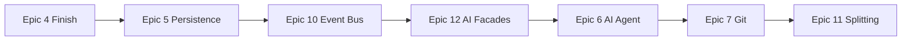

# CHAM Synthesis Report - Via-Gent Project Alpha

**Date:** 2025-12-13  
**Audit ID:** CHAM-2025-12-13-ADVANCED  
**Phase:** Synthesis (3/5)

---

## Executive Summary

The Via-Gent Project Alpha spike is **architecturally sound** with proper patterns implemented. The main issues are **code complexity** (6 oversized files) and **missing integration layers** (AI agent tools, event bus). The codebase is clean with no technical debt markers.

### Health Score: 78/100

| Category | Score | Notes |
|----------|-------|-------|
| Architecture | 22/25 | Layered, clean separation |
| Code Quality | 18/25 | 6 files need splitting |
| Integration | 20/25 | Core integrations work |
| Test Coverage | 10/15 | 16%, needs improvement |
| Security | 8/10 | No issues found |

---

## Scan Results Summary

### 1. Architecture Compliance ✅

- Layered architecture followed: `routes/` → `components/` → `lib/`
- Context pattern properly implemented
- Route loaders for data fetching
- Adapter pattern for external APIs

### 2. Dependency Hygiene ✅

- All dependencies at current versions
- No duplicate/conflicting packages
- Tree-shakeable imports used
- 2 unused deps (awaiting future epics)

### 3. Type Safety ✅

- TypeScript strict mode enabled
- No `any` types found in critical paths
- Zod schemas for route validation
- Proper interface exports

### 4. State Management ⚠️

- WorkspaceContext centralized state ✅
- SyncManager uses callbacks (no event bus)
- ProjectStore properly isolated
- **Gap**: No global event system for AI observability

### 5. Performance ⚠️

- Large files may impact bundle size
- Lazy loading used for route components
- **Gap**: No code splitting within large files
- WebContainer boot is async (correct)

### 6. Test Coverage ⚠️

| Layer | Files | Tests | Coverage |
|-------|-------|-------|----------|
| lib/filesystem | 6 | 3 | 50% |
| lib/workspace | 3 | 2 | 66% |
| lib/persistence | 2 | 1 | 50% |
| lib/webcontainer | 4 | 0 | 0% |
| lib/editor | 2 | 1 | 50% |
| components | 12 | 0 | 0% |
| routes | 11 | 0 | 0% |

### 7. UX Consistency ✅

- Consistent file icons
- Toast notifications implemented
- Sync status indicator exists
- Resizable panels work

### 8. Security & Data Flow ✅

- No sensitive data in code
- FSA permissions per-session
- BYOK for API keys
- No server data transmission

---

## Integration Gaps Analysis

### End-to-End User Journey

```
Dashboard → Open Project → Edit Files → Save → Sync → Git Commit

[x] Dashboard lists projects (Story 3-7)
[x] Open project loads workspace (Story 3-8)
[x] FileTree shows files (Story 3-2)
[x] Editor opens files (Story 4-1)
[x] Save syncs to both FS (Story 4-2)
[ ] Git commit to local (Epic 7)
[ ] AI agent edits files (Epic 6)
```

### Critical Integration Points

| From | To | Status | Epic |
|------|-----|--------|------|
| Dashboard | ProjectStore | ✅ Done | 3-7 |
| Workspace | WorkspaceContext | ✅ Done | 3-8 |
| FileTree | LocalFSAdapter | ✅ Done | 3-1 |
| Editor | SyncManager | ✅ Done | 4-2 |
| SyncManager | WebContainer | ✅ Done | 3-3 |
| AI Agent | FileTools | ⏳ Planned | 12-1 |
| AI Agent | TerminalTools | ⏳ Planned | 12-2 |
| LocalFS | isomorphic-git | ⏳ Planned | 7-1 |

---

## Remediation Priority Matrix

### P0 - Blocking Full-Scale IDE

| Item | Epic | Effort | Impact |
|------|------|--------|--------|
| Complete 4-0-1 Dashboard | 4 | S | HIGH |
| Event Bus | 10-1 | S | HIGH |
| AI Tool Facades | 12 | M | HIGH |

### P1 - Code Quality

| Item | Epic | Effort | Impact |
|------|------|--------|--------|
| Split local-fs-adapter | 11-1, 11-2 | M | MEDIUM |
| Split sync-manager | 11-3, 11-4 | M | MEDIUM |
| Split FileTree | 11-7 | S | MEDIUM |

### P2 - Deferred

| Item | Epic | Notes |
|------|------|-------|
| Git Integration | 7 | After AI tools |
| Project Fugu | 4.5 | Chrome 122+ |
| Multi-root | 9 | After event bus |

---

## Recommended Epic Order for Full-Scale IDE



### Rationale

1. **Epic 4/5**: Complete foundation (dashboard, persistence)
2. **Epic 10**: Event bus enables AI observability
3. **Epic 12**: Facades expose subsystems to AI
4. **Epic 6**: AI integration uses facades
5. **Epic 7**: Git for full workflow
6. **Epic 11**: Code splitting (can parallelize)
