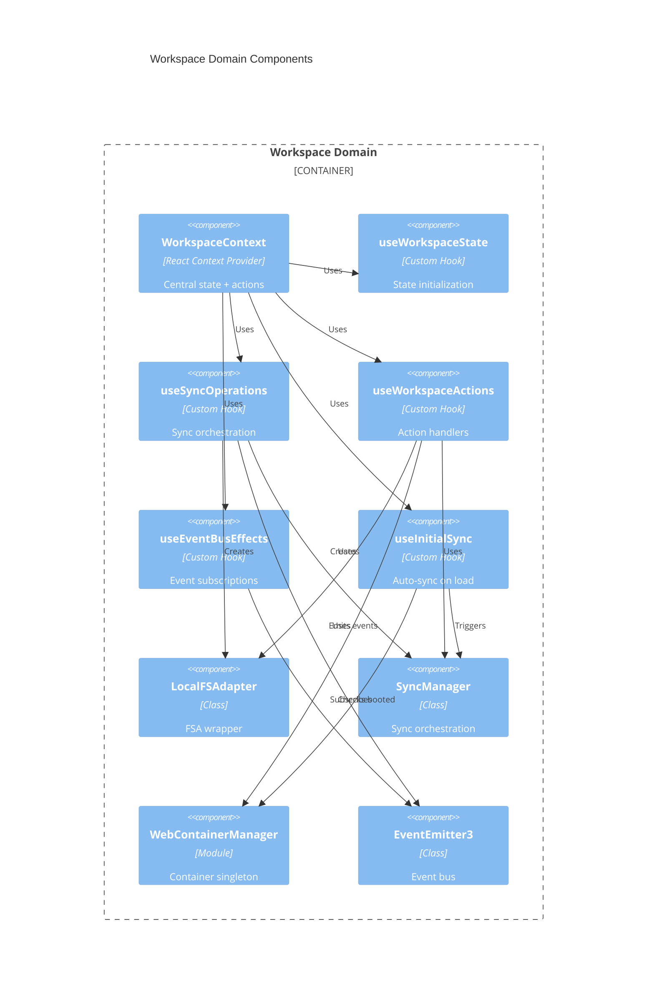
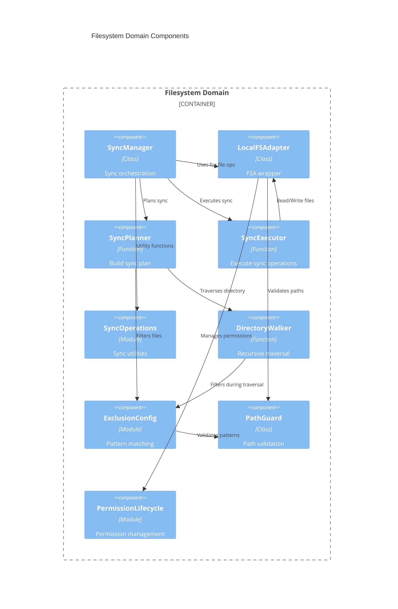
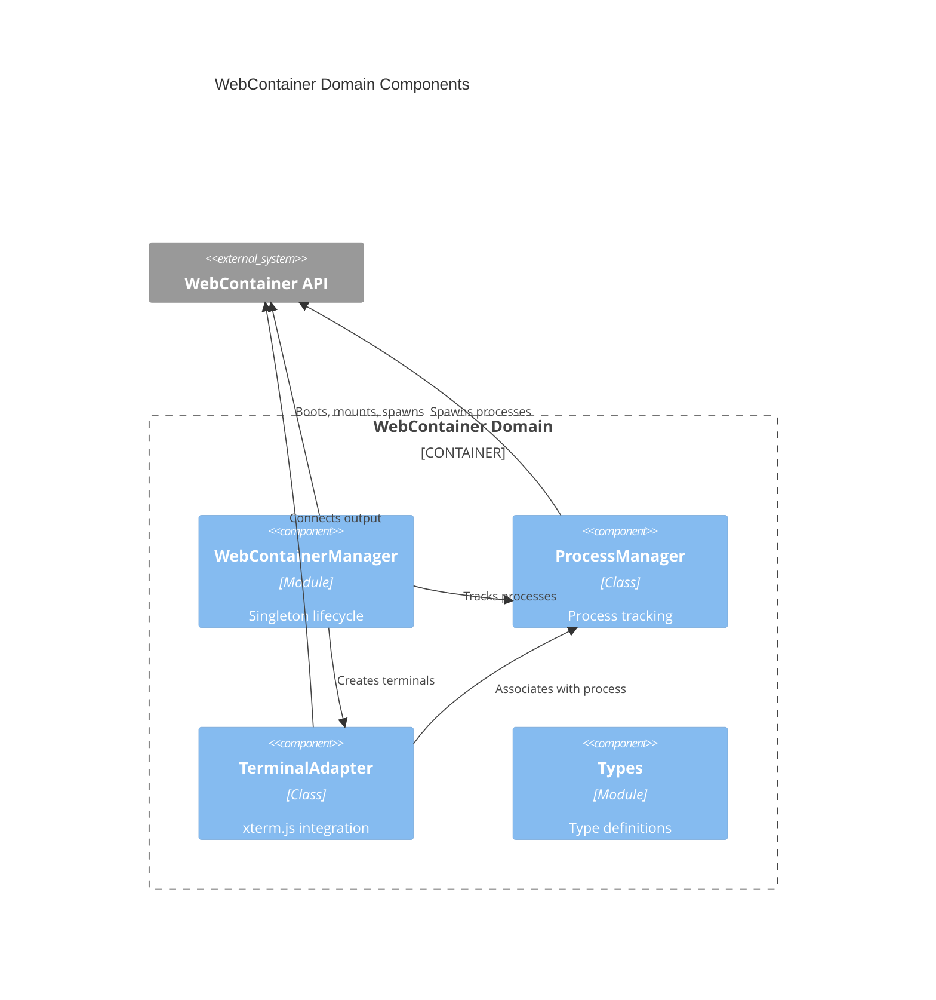

# Via-gent Architecture Documentation

**Analysis Date:** 2025-12-23  
**Project:** Via-gent - Browser-based IDE with WebContainers  
**Repository:** project-alpha-master

---

## Executive Summary

Via-gent is a single-page React application that provides a browser-based IDE experience using WebContainers for local code execution. The architecture follows a client-side SPA pattern with no server-side rendering, enabling direct browser access to local file systems and WebContainer sandboxes.

**Key Architectural Characteristics:**
- **100% Client-Side:** No SSR, all rendering happens in browser
- **Local FS as Source of Truth:** File System Access API for direct local file access
- **WebContainer Mirror:** One-way sync from local FS to WebContainer sandbox
- **Event-Driven:** Decoupled communication via EventEmitter3-based event bus
- **State Management:** React Context + TanStack Store + IndexedDB (Dexie)
- **Multi-Agent Ready:** Agent tool facades for AI integration (Epic 12, 25)

---

## C4 Context Diagram

```mermaid
C4Context
    title Via-gent System Context
    
    Person(user, "Developer", "Uses browser-based IDE")
    
    System(boundary, "Via-gent Application", "Browser-based IDE") {
        System(web_app, "Via-gent SPA", "React 19 + Vite application")
    }
    
    System_Ext(webcontainer, "WebContainer API", "StackBlitz WebContainers")
    System_Ext(local_fs, "Local File System", "File System Access API")
    System_Ext(indexeddb, "IndexedDB", "Browser storage for persistence")
    System_Ext(sentry, "Sentry", "Error monitoring")
    
    Rel(user, web_app, "Opens folder, edits code, runs commands")
    Rel(web_app, local_fs, "Read/Write files via FSA")
    Rel(web_app, webcontainer, "Mount files, spawn processes")
    Rel(web_app, indexeddb, "Persist projects, IDE state, AI tasks")
    Rel(web_app, sentry, "Report errors")
```

---

## C4 Container Diagram

```mermaid
C4Container
    title Via-gent Container Architecture
    
    Person(user, "Developer")
    
    Container_Boundary(spa, "Via-gent SPA") {
        Container(router, "TanStack Router", "File-based routing, SSR disabled")
        Container(workspace_ctx, "WorkspaceContext", "Central state management")
        Container(sync_manager, "SyncManager", "File sync orchestration")
        Container(wc_manager, "WebContainer Manager", "Container lifecycle")
        Container(event_bus, "Event Bus", "EventEmitter3-based")
        Container(db, "Dexie Database", "IndexedDB wrapper")
        
        Container(ui, "UI Components", "React components organized by feature") {
            Component(ide_layout, "IDELayout", "Main layout")
            Component(editor, "Monaco Editor", "Code editing")
            Component(terminal, "XTerminal", "Terminal integration")
            Component(file_tree, "FileTree", "File explorer")
            Component(chat_panel, "AgentChatPanel", "AI chat interface")
        }
    }
    
    System_Ext(webcontainer, "WebContainer API")
    System_Ext(local_fs, "Local File System")
    System_Ext(indexeddb, "IndexedDB")
    
    Rel(user, router, "Navigates")
    Rel(router, workspace_ctx, "Provides projectId")
    Rel(workspace_ctx, sync_manager, "Triggers sync")
    Rel(sync_manager, local_fs, "Read/Write via LocalFSAdapter")
    Rel(sync_manager, webcontainer, "Mount files")
    Rel(workspace_ctx, wc_manager, "Boots container")
    Rel(wc_manager, webcontainer, "Spawn processes")
    Rel(workspace_ctx, db, "Persist/Load state")
    Rel(sync_manager, event_bus, "Emit sync events")
    Rel(wc_manager, event_bus, "Emit container events")
    Rel(ui, workspace_ctx, "useWorkspace() hook")
    Rel(ui, event_bus, "Subscribe to events")
```

---

## C4 Component Diagram - Workspace Domain



---

## C4 Component Diagram - Filesystem Domain



---

## C4 Component Diagram - WebContainer Domain



---

## C4 Component Diagram - Agent Tool Domain

```mermaid
C4Component
    title Agent Tool Domain (Epic 12, 25)
    
    Container_Boundary(agent_tools, "Agent Tool Domain") {
        Component(file_tools_iface, "AgentFileTools", "Interface", "Stable contract")
        Component(file_tools_impl, "FileToolsImpl", "Class", "Implementation")
        Component(path_validator, "validatePath", "Function", "Path validation")
        Component(task_context, "TaskContextRecord", "Interface", "AI task tracking")
        Component(tool_exec, "ToolExecutionRecord", "Interface", "Tool audit trail")
    }
    
    Container_Boundary(filesystem, "Filesystem Domain") {
        Component(local_adapter, "LocalFSAdapter", "Class")
        Component(sync_mgr, "SyncManager", "Class")
    }
    
    Container_Boundary(events, "Event System") {
        Component(event_bus, "EventEmitter3", "Class")
    }
    
    Rel(file_tools_impl, local_adapter, "Wraps for file ops")
    Rel(file_tools_impl, sync_mgr, "Wraps for sync")
    Rel(file_tools_impl, event_bus, "Emits events")
    Rel(file_tools_impl, path_validator, "Validates paths")
    Rel(file_tools_impl, file_tools_iface, "Implements")
    Rel(task_context, "db", "Stored in Dexie")
    Rel(tool_exec, "db", "Stored in Dexie")
```

---

## Layer Architecture

```
┌─────────────────────────────────────────────────────────────────┐
│                        Presentation Layer                        │
│  ┌────────────────────────────────────────────────────────────┐ │
│  │  UI Components (React 19)                                   │ │
│  │  - IDE Components (editor, terminal, file tree, chat)      │ │
│  │  - Layout Components (IDELayout, HeaderBar, PanelShell)    │ │
│  │  - UI Components (shadcn/ui primitives)                    │ │
│  └────────────────────────────────────────────────────────────┘ │
└─────────────────────────────────────────────────────────────────┘
                              ↓
┌─────────────────────────────────────────────────────────────────┐
│                         Application Layer                        │
│  ┌────────────────────────────────────────────────────────────┐ │
│  │  WorkspaceContext (React Context)                           │ │
│  │  - State management (useWorkspaceState)                    │ │
│  │  - Actions (useWorkspaceActions)                           │ │
│  │  - Sync operations (useSyncOperations)                     │ │
│  │  - Event effects (useEventBusEffects)                      │ │
│  └────────────────────────────────────────────────────────────┘ │
│  ┌────────────────────────────────────────────────────────────┐ │
│  │  Routing (TanStack Router)                                  │ │
│  │  - File-based routes (SSR disabled)                        │ │
│  │  - Navigation hooks                                         │ │
│  └────────────────────────────────────────────────────────────┘ │
└─────────────────────────────────────────────────────────────────┘
                              ↓
┌─────────────────────────────────────────────────────────────────┐
│                          Domain Layer                            │
│  ┌────────────────────────────────────────────────────────────┐ │
│  │  Filesystem Domain                                          │ │
│  │  - LocalFSAdapter (FSA wrapper)                            │ │
│  │  - SyncManager (sync orchestration)                         │ │
│  │  - SyncPlanner, SyncExecutor                                │ │
│  │  - DirectoryWalker, ExclusionConfig                         │ │
│  └────────────────────────────────────────────────────────────┘ │
│  ┌────────────────────────────────────────────────────────────┐ │
│  │  WebContainer Domain                                        │ │
│  │  - WebContainerManager (singleton)                          │ │
│  │  - ProcessManager (process tracking)                        │ │
│  │  - TerminalAdapter (xterm.js integration)                   │ │
│  └────────────────────────────────────────────────────────────┘ │
│  ┌────────────────────────────────────────────────────────────┐ │
│  │  Agent Tool Domain (Epic 12, 25)                            │ │
│  │  - AgentFileTools (interface)                              │ │
│  │  - FileToolsImpl (implementation)                           │ │
│  └────────────────────────────────────────────────────────────┘ │
└─────────────────────────────────────────────────────────────────┘
                              ↓
┌─────────────────────────────────────────────────────────────────┐
│                       Infrastructure Layer                       │
│  ┌────────────────────────────────────────────────────────────┐ │
│  │  Event System (EventEmitter3)                               │ │
│  │  - WorkspaceEventEmitter (typed events)                     │ │
│  │  - Event bus for decoupled communication                   │ │
│  └────────────────────────────────────────────────────────────┘ │
│  ┌────────────────────────────────────────────────────────────┐ │
│  │  Persistence (Dexie.js)                                     │ │
│  │  - ProjectRecord, IDEStateRecord                           │ │
│  │  - ConversationRecord, TaskContextRecord                    │ │
│  │  - ToolExecutionRecord                                      │ │
│  └────────────────────────────────────────────────────────────┘ │
│  ┌────────────────────────────────────────────────────────────┐ │
│  │  External APIs                                              │ │
│  │  - File System Access API (local FS)                       │ │
│  │  - WebContainer API (StackBlitz)                            │ │
│  │  - IndexedDB (browser storage)                             │ │
│  └────────────────────────────────────────────────────────────┘ │
└─────────────────────────────────────────────────────────────────┘
```

---

## Key Architectural Decisions

### 1. Local FS as Source of Truth

**Decision:** Local file system (via File System Access API) is the authoritative source. WebContainers mirror local files with one-way sync.

**Rationale:**
- User expects local files to persist
- WebContainer is ephemeral sandbox
- Avoids sync conflicts from bidirectional sync
- Simplifies permission handling

**Trade-offs:**
- Changes in WebContainer (e.g., `npm install`) don't sync back
- Requires explicit sync triggers for WebContainer changes

**Location:** [`src/lib/filesystem/sync-manager.ts`](src/lib/filesystem/sync-manager.ts:8-11)

### 2. Singleton WebContainer

**Decision:** Only one WebContainer instance per page via singleton pattern.

**Rationale:**
- WebContainer API limitation: only one instance per page
- Simplifies state management
- Reduces resource usage

**Trade-offs:**
- Cannot run multiple projects simultaneously
- Requires project switching workflow

**Location:** [`src/lib/webcontainer/manager.ts`](src/lib/webcontainer/manager.ts:35-37)

### 3. Event-Driven Architecture

**Decision:** Decoupled communication via EventEmitter3-based event bus.

**Rationale:**
- Enables loose coupling between domains
- Supports multiple subscribers to same events
- Facilitates observability and debugging
- Supports AI agent event consumption (Epic 25)

**Trade-offs:**
- Event flow can be harder to trace
- Requires careful event naming conventions

**Location:** [`src/lib/events/workspace-events.ts`](src/lib/events/workspace-events.ts:1-50)

### 4. React Context + TanStack Store

**Decision:** Hybrid state management with React Context for global state and TanStack Store for reactive state.

**Rationale:**
- Context provides simple global state access
- TanStack Store offers fine-grained reactivity
- Fits React 19 patterns

**Trade-offs:**
- Two state systems to understand
- Potential duplication of state

**Location:** [`src/lib/workspace/WorkspaceContext.tsx`](src/lib/workspace/WorkspaceContext.tsx:1-102)

### 5. Agent Tool Facade Pattern

**Decision:** Stable interface layer for AI agent file operations (Epic 12).

**Rationale:**
- Decouples agents from implementation details
- Enables safe agent operations with validation
- Provides event emission for observability
- Supports future agent implementations

**Trade-offs:**
- Additional abstraction layer
- Requires maintaining interface contracts

**Location:** [`src/lib/agent/facades/file-tools.ts`](src/lib/agent/facades/file-tools.ts:1-112)

### 6. IndexedDB via Dexie.js

**Decision:** Use Dexie.js wrapper for IndexedDB persistence (Epic 27-1c).

**Rationale:**
- Type-safe database API
- Automatic schema versioning
- Live query support with hooks
- Better DX than raw IndexedDB

**Trade-offs:**
- Additional dependency
- Learning curve for Dexie API

**Location:** [`src/lib/state/dexie-db.ts`](src/lib/state/dexie-db.ts:1-243)

### 7. No Server-Side Rendering

**Decision:** Disable SSR in TanStack Router for WebContainer compatibility.

**Rationale:**
- WebContainers require cross-origin isolation headers
- SSR conflicts with File System Access API
- Simplifies deployment (static hosting)

**Trade-offs:**
- No SEO benefits
- Slower initial page load
- No server-side data fetching

**Location:** [`src/routes/__root.tsx`](src/routes/__root.tsx:1-95)

---

## Integration Surfaces

### File System Access API Integration

**Purpose:** Direct access to local file system from browser

**Entry Point:** [`src/lib/filesystem/local-fs-adapter.ts`](src/lib/filesystem/local-fs-adapter.ts:1)

**Key Operations:**
- `requestDirectoryAccess()` - Request folder picker
- `readFile()` - Read file content
- `writeFile()` - Write file content
- `listDirectory()` - List directory contents
- `createDirectory()` - Create directory
- `deleteFile()` - Delete file
- `deleteDirectory()` - Delete directory

**Permission Handling:** [`src/lib/filesystem/permission-lifecycle.ts`](src/lib/filesystem/permission-lifecycle.ts:1)

### WebContainer API Integration

**Purpose:** Run code in browser sandbox

**Entry Point:** [`src/lib/webcontainer/manager.ts`](src/lib/webcontainer/manager.ts:1)

**Key Operations:**
- `boot()` - Boot WebContainer (singleton)
- `mount()` - Mount file system tree
- `spawn()` - Spawn process
- `getFileSystem()` - Get FS API
- `onServerReady()` - Subscribe to server events

**Terminal Integration:** [`src/lib/webcontainer/terminal-adapter.ts`](src/lib/webcontainer/terminal-adapter.ts:1)

### IndexedDB Integration

**Purpose:** Persist projects, IDE state, AI tasks

**Entry Point:** [`src/lib/state/dexie-db.ts`](src/lib/state/dexie-db.ts:1)

**Tables:**
- `projects` - Project metadata
- `ideState` - IDE state per project
- `conversations` - AI chat history
- `taskContexts` - AI agent task tracking (Epic 25)
- `toolExecutions` - Tool execution audit trail (Epic 25)

### TanStack Router Integration

**Purpose:** Client-side routing

**Entry Point:** [`src/router.tsx`](src/router.tsx:1)

**Configuration:**
- SSR disabled
- File-based routes
- Route tree auto-generated

---

## Cross-Cutting Concerns

### Error Handling

**Strategy:** Custom error classes with error codes

**Error Types:**
- `SyncError` ([`src/lib/filesystem/sync-types.ts`](src/lib/filesystem/sync-types.ts:43))
- `WebContainerError` ([`src/lib/webcontainer/types.ts`](src/lib/webcontainer/types.ts:1))
- `PathValidationError` ([`src/lib/agent/facades/file-tools.ts`](src/lib/agent/facades/file-tools.ts:93))

**Error Monitoring:** Sentry integration ([`src/lib/monitoring/sentry.ts`](src/lib/monitoring/sentry.ts:1))

### Internationalization

**Strategy:** i18next with browser language detection

**Configuration:** [`src/i18n/config.ts`](src/i18n/config.ts:1)

**Languages:** English (en), Vietnamese (vi)

**Key Extraction:** `pnpm i18n:extract`

### Theming

**Strategy:** next-themes with Tailwind CSS

**Provider:** [`src/components/ui/ThemeProvider.tsx`](src/components/ui/ThemeProvider.tsx:1)

**Theme Toggle:** [`src/components/ui/ThemeToggle.tsx`](src/components/ui/ThemeToggle.tsx:1)

### Observability

**Strategy:** Event bus + Sentry

**Event Bus:** [`src/lib/events/workspace-events.ts`](src/lib/events/workspace-events.ts:1)

**Sentry:** [`src/lib/monitoring/sentry.ts`](src/lib/monitoring/sentry.ts:1)

**Key Events:**
- `sync:*` - Sync lifecycle events
- `container:*` - WebContainer lifecycle events
- `file:*` - File operation events
- `process:*` - Process events
- `permission:*` - Permission events

---

## Performance Considerations

### WebContainer Boot

**Cost:** ~3-5 seconds

**Mitigation:**
- Singleton pattern (boot once per page)
- Emit `container:booted` event for coordination
- Show loading state during boot

**Location:** [`src/lib/webcontainer/manager.ts`](src/lib/webcontainer/manager.ts:65-118)

### File Sync Performance

**Target:** <3s for 100 files, <500ms for single file write

**Mitigation:**
- Lazy directory traversal
- Debounced batch operations
- Exclude `node_modules` and `.git`
- Pre-scan for accurate progress

**Location:** [`src/lib/filesystem/sync-manager.ts`](src/lib/filesystem/sync-manager.ts:167-171)

### Monaco Editor Performance

**Strategy:** On-demand language loading

**Location:** [`src/components/ide/MonacoEditor/`](src/components/ide/MonacoEditor/)

---

## Security Considerations

### Cross-Origin Isolation

**Requirement:** WebContainers require COOP/COEP headers

**Implementation:** [`vite.config.ts`](vite.config.ts:1)

**Headers:**
```
Cross-Origin-Opener-Policy: same-origin
Cross-Origin-Embedder-Policy: require-corp
Cross-Origin-Resource-Policy: cross-origin
```

### Path Traversal Protection

**Implementation:** [`src/lib/agent/facades/file-tools.ts`](src/lib/agent/facades/file-tools.ts:105-112)

**Validation:**
- No `..` in paths
- No absolute paths
- Relative paths only

### Permission Handling

**Strategy:** Ephemeral permissions with restoration

**Implementation:** [`src/lib/filesystem/permission-lifecycle.ts`](src/lib/filesystem/permission-lifecycle.ts:1)

---

## Deployment Architecture

### Deployment Targets

**Primary:** Netlify (static hosting)

**Alternative:** Cloudflare Workers

**Configuration:**
- [`netlify.toml`](netlify.toml:1)
- [`wrangler.jsonc`](wrangler.jsonc:1)

### Build Process

**Tool:** Vite 7.3.0

**Scripts:**
- `pnpm dev` - Development server (port 3000)
- `pnpm build` - Production build
- `pnpm preview` - Preview production build

**Output:** Static assets for CDN deployment

---

## Technology Stack Summary

| Layer | Technology | Version | Purpose |
|-------|-----------|---------|---------|
| Frontend | React | 19.2.3 | UI framework |
| Routing | TanStack Router | 1.141.8 | Client-side routing |
| State | TanStack Store, Context API | 0.8.0 | State management |
| Persistence | Dexie.js | 4.2.1 | IndexedDB wrapper |
| Container | WebContainer API | 1.6.1 | Code execution sandbox |
| Editor | Monaco Editor | 0.55.1 | Code editor |
| Terminal | xterm.js | 5.5.0 | Terminal emulation |
| Events | EventEmitter3 | 5.0.1 | Event bus |
| i18n | i18next | 23.10.1 | Internationalization |
| Styling | Tailwind CSS | 4.1.18 | Utility-first CSS |
| Build | Vite | 7.3.0 | Build tool |
| Testing | Vitest | 3.2.4 | Test framework |
| Monitoring | Sentry | 10.32.1 | Error tracking |

---

**Document Metadata**
- **Created:** 2025-12-23
- **Author:** BMAD Architect Mode
- **Status:** Phase 2 Complete
- **Related Artifacts:** 
  - [`structure-map.md`](structure-map.md:1)
  - [`data-and-contracts.md`](data-and-contracts.md:1)
  - [`flows-and-workflows.md`](flows-and-workflows.md:1)
  - [`tech-context.md`](tech-context.md:1)