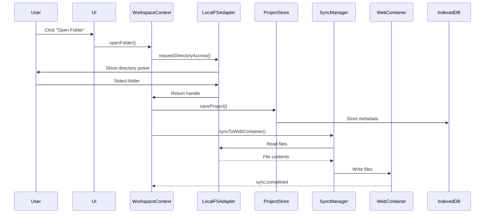
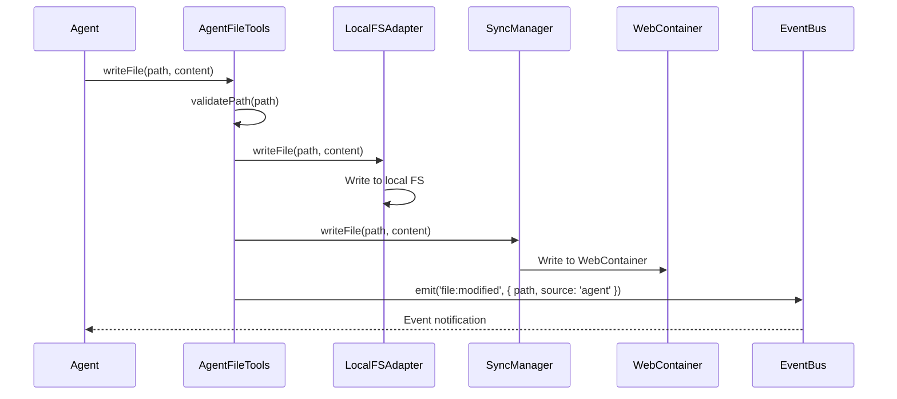

# Data and Contracts

**Analysis Date:** 2025-12-23  
**Project:** Via-gent Browser-Based IDE  
**Purpose:** Canonical view of data models, schemas, and contracts

---

## Table of Contents

1. [Data Models](#data-models)
2. [IndexedDB Schema](#indexeddb-schema)
3. [Type Definitions](#type-definitions)
4. [API Contracts](#api-contracts)
5. [Event Contracts](#event-contracts)
6. [Validation Rules](#validation-rules)

---

## Data Models

### ProjectMetadata

**Location:** [`src/lib/workspace/project-store.ts`](../src/lib/workspace/project-store.ts:37)

**Purpose:** Core project metadata stored in IndexedDB for project persistence and permission restoration.

```typescript
interface ProjectMetadata {
    /** UUID v4 or generated ID */
    id: string;
    /** Display name (typically folder name) */
    name: string;
    /** Display path for UI (not actual path due to FSA security) */
    folderPath: string;
    /** FSA handle for directory access restoration */
    fsaHandle: FileSystemDirectoryHandle;
    /** Last time project was opened */
    lastOpened: Date;
    /** Auto-sync enabled flag */
    autoSync?: boolean;
    /** Optional layout state for IDE restoration */
    layoutState?: LayoutConfig;
    /** Custom exclusion patterns for sync (glob syntax) */
    exclusionPatterns?: string[];
    /** Last known permission state for faster dashboard load */
    lastKnownPermissionState?: FsaPermissionState;
}
```

**Constraints:**
- `id` must be unique (UUID v4 or timestamp-based fallback)
- `fsaHandle` is a browser File System Access API handle (cannot be serialized)
- `lastOpened` is used for sorting projects in dashboard

---

### WorkspaceState

**Location:** [`src/lib/workspace/workspace-types.ts`](../src/lib/workspace/workspace-types.ts:13)

**Purpose:** Runtime state for the IDE workspace context.

```typescript
interface WorkspaceState {
    /** Current project ID from route */
    projectId: string | null;
    /** Project metadata from IndexedDB */
    projectMetadata: ProjectMetadata | null;
    /** FSA directory handle for local folder */
    directoryHandle: FileSystemDirectoryHandle | null;
    /** Current permission state for the handle */
    permissionState: FsaPermissionState;
    /** Current sync status */
    syncStatus: SyncStatus;
    /** Progress during sync operation */
    syncProgress: SyncProgress | null;
    /** Timestamp of last successful sync */
    lastSyncTime: Date | null;
    /** Error message from last sync attempt */
    syncError: string | null;
    autoSync: boolean;
    /** Whether folder is currently being opened */
    isOpeningFolder: boolean;
    /** Current exclusion patterns (default + custom) */
    exclusionPatterns: string[];
    /** Whether WebContainer has completed booting */
    isWebContainerBooted: boolean;
    /** Whether initial sync has completed */
    initialSyncCompleted: boolean;
}
```

**State Transitions:**
- `syncStatus`: `'idle'` → `'syncing'` → `'idle'` (or `'error'`)
- `permissionState`: `'unknown'` → `'granted'` | `'prompt'` | `'denied'`

---

### LayoutConfig

**Location:** [`src/lib/workspace/project-store.ts`](../src/lib/workspace/project-store.ts:28)

**Purpose:** IDE layout state persisted per project.

```typescript
interface LayoutConfig {
    panelSizes?: number[];
    openFiles?: string[];
    activeFile?: string | null;
}
```

---

## IndexedDB Schema

### Database: `via-gent-persistence` (Version 3)

**Location:** [`src/lib/state/dexie-db.ts`](../src/lib/state/dexie-db.ts)

### Table: `projects`

**Primary Key:** `id` (string)

**Indexes:**
- `by-last-opened` → `lastOpened` (Date)

**Schema:**
```typescript
interface ProjectRecord {
    id: string;
    name: string;
    folderPath: string;
    fsaHandle: FileSystemDirectoryHandle;
    lastOpened: Date;
    autoSync: boolean;
    layoutState?: LayoutConfig;
    exclusionPatterns?: string[];
    lastKnownPermissionState?: FsaPermissionState;
}
```

**Purpose:** Store project metadata for dashboard and permission restoration.

---

### Table: `conversations`

**Primary Key:** `id` (string)

**Indexes:**
- `by-project-id` → `projectId` (string)
- `by-updated-at` → `updatedAt` (Date)

**Schema:**
```typescript
interface ConversationRecord {
    id: string;
    projectId: string;
    messages: unknown[];
    toolResults?: unknown[];
    updatedAt: Date;
}
```

**Purpose:** Store AI agent conversation history (Epic 25 prep).

---

### Table: `ideState`

**Primary Key:** `projectId` (string)

**Indexes:**
- `by-project-id` → `projectId` (string)
- `by-updated-at` → `updatedAt` (Date)

**Schema:**
```typescript
interface IdeStateRecord {
    projectId: string;
    panelLayouts?: Record<string, number[]>;
    panelSizes?: number[];
    openFiles?: string[];
    activeFile?: string | null;
    activeFileScrollTop?: number;
    terminalTab?: 'terminal' | 'output' | 'problems';
    chatVisible?: boolean;
    updatedAt: Date;
}
```

**Purpose:** Store IDE-specific state (panel layouts, open files, etc.).

---

### Table: `taskContexts`

**Primary Key:** `id` (string)

**Indexes:**
- `by-project-id` → `projectId` (string)

**Schema:**
```typescript
interface TaskContextRecord {
    id: string;
    projectId: string;
    context: unknown;
    createdAt: Date;
    updatedAt: Date;
}
```

**Purpose:** Store AI agent task context (Epic 25 prep).

---

### Table: `toolExecutions`

**Primary Key:** `id` (string)

**Indexes:**
- `by-project-id` → `projectId` (string)
- `by-conversation-id` → `conversationId` (string)

**Schema:**
```typescript
interface ToolExecutionRecord {
    id: string;
    projectId: string;
    conversationId?: string;
    toolName: string;
    input: unknown;
    output: unknown;
    status: 'pending' | 'success' | 'error';
    error?: string;
    startedAt: Date;
    completedAt?: Date;
}
```

**Purpose:** Store AI agent tool execution history (Epic 25 prep).

---

## Type Definitions

### File System Types

**Location:** [`src/lib/filesystem/fs-types.ts`](../src/lib/filesystem/fs-types.ts)

#### DirectoryEntry

```typescript
interface DirectoryEntry {
    /** Name of the file or directory (basename, not full path) */
    name: string;
    /** Type of entry */
    type: 'file' | 'directory';
    /** Native File System Access API handle */
    handle: FileSystemHandle;
}
```

#### FileReadResult

```typescript
interface FileReadResult {
    /** File content as UTF-8 string */
    content: string;
    /** Encoding used */
    encoding: 'utf-8';
}
```

#### FileReadBinaryResult

```typescript
interface FileReadBinaryResult {
    /** Raw binary data as ArrayBuffer */
    data: ArrayBuffer;
    /** MIME type of the file */
    mimeType?: string;
}
```

---

### Sync Types

**Location:** [`src/lib/filesystem/sync-types.ts`](../src/lib/filesystem/sync-types.ts)

#### SyncStatus

```typescript
type SyncStatus = 'idle' | 'syncing' | 'error';
```

#### SyncErrorCode

```typescript
type SyncErrorCode =
    | 'PERMISSION_DENIED'
    | 'FILE_NOT_FOUND'
    | 'FILE_READ_FAILED'
    | 'FILE_WRITE_FAILED'
    | 'DISK_FULL'
    | 'WEBCONTAINER_ERROR'
    | 'WEBCONTAINER_NOT_BOOTED'
    | 'ENCODING_ERROR'
    | 'SYNC_FAILED'
    | 'UNKNOWN';
```

#### SyncProgress

```typescript
interface SyncProgress {
    /** Total number of files/directories processed */
    totalFiles: number;
    /** Number of files successfully synced */
    syncedFiles: number;
    /** Current file being processed */
    currentFile: string;
    /** Percentage complete (0-100) */
    percentage: number;
}
```

#### SyncResult

```typescript
interface SyncResult {
    /** Whether sync completed without critical errors */
    success: boolean;
    /** Total number of files/directories encountered */
    totalFiles: number;
    /** Number of files successfully synced */
    syncedFiles: number;
    /** List of file paths that failed to sync */
    failedFiles: string[];
    /** Total duration in milliseconds */
    duration: number;
}
```

#### SyncConfig

```typescript
interface SyncConfig {
    /** Patterns to exclude from sync */
    excludePatterns: string[];
    /** Callback for progress updates */
    onProgress?: (progress: SyncProgress) => void;
    /** Callback for individual file errors */
    onError?: (error: SyncError) => void;
    /** Callback when sync completes */
    onComplete?: (result: SyncResult) => void;
    /** Pre-scan to compute accurate file count */
    preScanFileCount?: boolean;
}
```

**Default Exclusions:**
```typescript
const DEFAULT_SYNC_CONFIG: SyncConfig = {
    excludePatterns: [
        '.git',
        'node_modules',
        '.DS_Store',
        'Thumbs.db',
        '*.swp',
        '*.swo',
        '.env.local',
        '.env.*.local',
    ],
    preScanFileCount: true,
};
```

---

### Permission Types

**Location:** [`src/lib/filesystem/permission-lifecycle.ts`](../src/lib/filesystem/permission-lifecycle.ts)

#### FsaPermissionState

```typescript
type FsaPermissionState = 'unknown' | 'granted' | 'prompt' | 'denied';
```

**State Meanings:**
- `'unknown'`: Permission state not yet queried
- `'granted'`: Permission granted (can access files)
- `'prompt'`: Permission available but needs user confirmation
- `'denied'`: Permission denied

---

### Agent Tool Types

**Location:** [`src/lib/agent/facades/file-tools.ts`](../src/lib/agent/facades/file-tools.ts)

#### FileEntry

```typescript
interface FileEntry {
    /** File or directory name */
    name: string;
    /** Relative path from project root */
    path: string;
    /** Entry type */
    type: 'file' | 'directory';
    /** File size in bytes (files only) */
    size?: number;
}
```

#### FileReadResult (Agent)

```typescript
interface FileReadResult {
    /** File content as string */
    content: string;
    /** File path that was read */
    path: string;
}
```

---

## API Contracts

### AgentFileTools Interface

**Location:** [`src/lib/agent/facades/file-tools.ts`](../src/lib/agent/facades/file-tools.ts:42)

**Purpose:** Stable contract for AI agent file operations (Epic 12).

```typescript
interface AgentFileTools {
    /**
     * Read a file's content
     * @param path - Relative path from project root
     * @returns File content or null if file doesn't exist
     */
    readFile(path: string): Promise<string | null>;

    /**
     * Write content to a file (creates if doesn't exist)
     * @param path - Relative path from project root
     * @param content - Content to write
     * @emits file:modified with source: 'agent'
     */
    writeFile(path: string, content: string): Promise<void>;

    /**
     * List contents of a directory
     * @param path - Relative path (empty string for root)
     * @param recursive - Whether to list recursively
     * @returns Array of file entries
     */
    listDirectory(path: string, recursive?: boolean): Promise<FileEntry[]>;

    /**
     * Create a new file
     * @param path - Relative path from project root
     * @param content - Initial content (default: empty string)
     * @emits file:created with source: 'agent'
     */
    createFile(path: string, content?: string): Promise<void>;

    /**
     * Delete a file
     * @param path - Relative path from project root
     * @emits file:deleted with source: 'agent'
     */
    deleteFile(path: string): Promise<void>;

    /**
     * Search for files by name pattern
     * @param query - Search query (substring match on filename)
     * @param basePath - Optional base path to search from
     * @returns Matching file entries
     */
    searchFiles(query: string, basePath?: string): Promise<FileEntry[]>;
}
```

**Path Validation:**
```typescript
function validatePath(path: string): void;
```
- Rejects paths containing `..` (path traversal)
- Rejects absolute paths (starting with `/` or drive letters)

---

### WorkspaceActions Interface

**Location:** [`src/lib/workspace/workspace-types.ts`](../src/lib/workspace/workspace-types.ts:41)

```typescript
interface WorkspaceActions {
    /** Open folder via picker, save to ProjectStore */
    openFolder(): Promise<void>;
    /** Always show picker, replace current handle */
    switchFolder(): Promise<void>;
    /** Trigger manual sync from LocalFS to WebContainer */
    syncNow(): Promise<void>;
    setAutoSync(enabled: boolean): Promise<void>;
    /** Update exclusion patterns and persist to ProjectStore */
    setExclusionPatterns(patterns: string[]): Promise<void>;
    /** Clear state and navigate to dashboard */
    closeProject(): void;
    /** Set WebContainer boot status for auto-sync */
    setIsWebContainerBooted(booted: boolean): void;
    /** Restore permission for 'prompt' state handles */
    restoreAccess(): Promise<void>;
}
```

---

### LocalFSAdapter Interface

**Location:** [`src/lib/filesystem/local-fs-adapter.ts`](../src/lib/filesystem/local-fs-adapter.ts:30)

```typescript
class LocalFSAdapter {
    static isSupported(): boolean;
    async requestDirectoryAccess(): Promise<FileSystemDirectoryHandle>;
    getDirectoryHandle(): FileSystemDirectoryHandle | null;
    setDirectoryHandle(handle: FileSystemDirectoryHandle): void;
    
    // File Operations
    async readFile(path: string, options?: { encoding?: 'utf-8' }): Promise<FileReadResult>;
    async readFile(path: string, options: { encoding: 'binary' }): Promise<FileReadBinaryResult>;
    async writeFile(path: string, content: string): Promise<void>;
    async createFile(path: string, content?: string): Promise<void>;
    async deleteFile(path: string): Promise<void>;
    
    // Directory Operations
    async listDirectory(path?: string): Promise<DirectoryEntry[]>;
    async createDirectory(path: string): Promise<void>;
    async deleteDirectory(path: string): Promise<void>;
    async rename(oldPath: string, newPath: string): Promise<void>;
}
```

---

### SyncManager Interface

**Location:** [`src/lib/filesystem/sync-manager.ts`](../src/lib/filesystem/sync-manager.ts)

```typescript
class SyncManager {
    constructor(
        localAdapter: LocalFSAdapter,
        webContainer: WebContainer,
        config?: Partial<SyncConfig>
    );
    
    async syncToWebContainer(options?: { fullSync?: boolean }): Promise<SyncResult>;
    async writeFile(path: string, content: string): Promise<void>;
    async deleteFile(path: string): Promise<void>;
    async createDirectory(path: string): Promise<void>;
    
    setExcludePatterns(patterns: string[]): void;
    getConfig(): SyncConfig;
}
```

---

## Event Contracts

### WorkspaceEvents

**Location:** [`src/lib/events/workspace-events.ts`](../src/lib/events/workspace-events.ts:3)

**EventEmitter:** `eventemitter3`

```typescript
interface WorkspaceEvents {
    // File System Events
    'file:created': [{ path: string; source: 'local' | 'editor' | 'agent' }];
    'file:modified': [{ path: string; source: 'local' | 'editor' | 'agent'; content?: string }];
    'file:deleted': [{ path: string; source: 'local' | 'editor' | 'agent' }];
    'directory:created': [{ path: string }];
    'directory:deleted': [{ path: string }];

    // Sync Events
    'sync:started': [{ fileCount: number; direction: 'to-wc' | 'to-local' | 'bidirectional' }];
    'sync:progress': [{ current: number; total: number; currentFile: string }];
    'sync:completed': [{ success: boolean; timestamp: Date; filesProcessed: number }];
    'sync:error': [{ error: Error; file?: string }];
    'sync:paused': [{ reason: 'user' | 'error' | 'permission' }];
    'sync:resumed': [];

    // WebContainer Events
    'container:booted': [{ bootTime: number }];
    'container:mounted': [{ fileCount: number }];
    'container:error': [{ error: Error }];

    // Terminal/Process Events
    'process:started': [{ pid: string; command: string; args: string[] }];
    'process:output': [{ pid: string; data: string; type: 'stdout' | 'stderr' }];
    'process:exited': [{ pid: string; exitCode: number }];
    'terminal:input': [{ data: string }];

    // Permission Events
    'permission:requested': [{ handle: FileSystemDirectoryHandle }];
    'permission:granted': [{ handle: FileSystemDirectoryHandle; projectId: string }];
    'permission:denied': [{ handle: FileSystemDirectoryHandle; reason: string }];
    'permission:expired': [{ projectId: string }];

    // Project Events
    'project:opened': [{ projectId: string; name: string }];
    'project:closed': [{ projectId: string }];
    'project:switched': [{ fromId: string | null; toId: string }];
}
```

**Event Usage:**
```typescript
import { createWorkspaceEventBus } from '@/lib/events';

const eventBus = createWorkspaceEventBus();

// Emit events
eventBus.emit('file:created', { path: 'src/index.ts', source: 'agent' });

// Listen to events
eventBus.on('sync:completed', ({ success, filesProcessed }) => {
    console.log(`Sync ${success ? 'succeeded' : 'failed'}, processed ${filesProcessed} files`);
});
```

---

## Validation Rules

### Path Validation

**Location:** [`src/lib/agent/facades/file-tools.ts`](../src/lib/agent/facades/file-tools.ts:105)

```typescript
function validatePath(path: string): void {
    if (path.includes('..')) {
        throw new PathValidationError('Path traversal (..) not allowed');
    }
    if (path.startsWith('/') || /^[a-zA-Z]:/.test(path)) {
        throw new PathValidationError('Absolute paths not allowed');
    }
}
```

**Rules:**
- No path traversal (`..`)
- No absolute paths (Unix `/` or Windows drive letters)
- Only relative paths from project root allowed

---

### File System Access API Support

**Location:** [`src/lib/filesystem/local-fs-adapter.ts`](../src/lib/filesystem/local-fs-adapter.ts:37)

```typescript
static isSupported(): boolean {
    return typeof window !== 'undefined' && 'showDirectoryPicker' in window;
}
```

**Browser Support:**
- Chrome 86+
- Edge 86+
- Not supported in Firefox, Safari

---

### Permission State Detection

**Location:** [`src/lib/filesystem/permission-lifecycle.ts`](../src/lib/filesystem/permission-lifecycle.ts:121)

```typescript
async function getPermissionState(
    handle: FileSystemDirectoryHandle,
    mode: 'read' | 'readwrite' = 'readwrite'
): Promise<FsaPermissionState>;
```

**Behavior:**
- Returns `'denied'` if `queryPermission` not available
- Returns `'denied'` on error
- Returns actual state otherwise

---

### Persistent Permission Support

**Location:** [`src/lib/filesystem/permission-lifecycle.ts`](../src/lib/filesystem/permission-lifecycle.ts:173)

```typescript
function isPersistentPermissionSupported(): boolean {
    if (typeof navigator === 'undefined') return false;
    if (typeof navigator.permissions === 'undefined') return false;
    return typeof navigator.permissions.query === 'function';
}
```

**Chrome 122+ Behavior:**
- Shows three-way permission prompt:
  - "Allow this time" (session only)
  - "Allow on every visit" (persistent)
  - "Block"
- Browser handles persistence automatically

---

## Data Flow Diagrams

### Project Open Flow



### File Write Flow (Agent)



---

## Migration History

### IndexedDB Schema Versions

| Version | Date | Changes |
|---------|------|---------|
| 1 | Initial | `projects` table only |
| 2 | Story 5-1 | Added `conversations`, `ideState` tables |
| 3 | Epic 27-1c | Added `taskContexts`, `toolExecutions` tables (AI Foundation prep) |

### Legacy Migration

**Location:** [`src/lib/workspace/project-store.ts`](../src/lib/workspace/project-store.ts:77)

- Migrates from `via-gent-projects` DB to unified `via-gent-persistence` DB
- One-time migration on first load
- Preserves existing project metadata

---

## References

- **IndexedDB Schema:** [`src/lib/state/dexie-db.ts`](../src/lib/state/dexie-db.ts)
- **Project Store:** [`src/lib/workspace/project-store.ts`](../src/lib/workspace/project-store.ts)
- **Workspace Types:** [`src/lib/workspace/workspace-types.ts`](../src/lib/workspace/workspace-types.ts)
- **File System Types:** [`src/lib/filesystem/fs-types.ts`](../src/lib/filesystem/fs-types.ts)
- **Sync Types:** [`src/lib/filesystem/sync-types.ts`](../src/lib/filesystem/sync-types.ts)
- **Agent Tools:** [`src/lib/agent/facades/file-tools.ts`](../src/lib/agent/facades/file-tools.ts)
- **Events:** [`src/lib/events/workspace-events.ts`](../src/lib/events/workspace-events.ts)
- **Permission Lifecycle:** [`src/lib/filesystem/permission-lifecycle.ts`](../src/lib/filesystem/permission-lifecycle.ts)