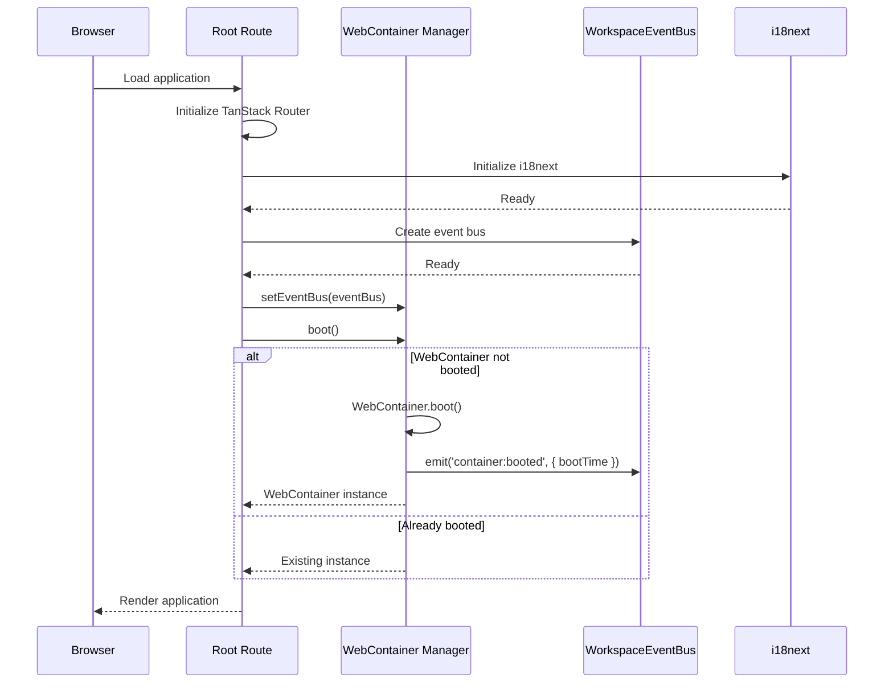
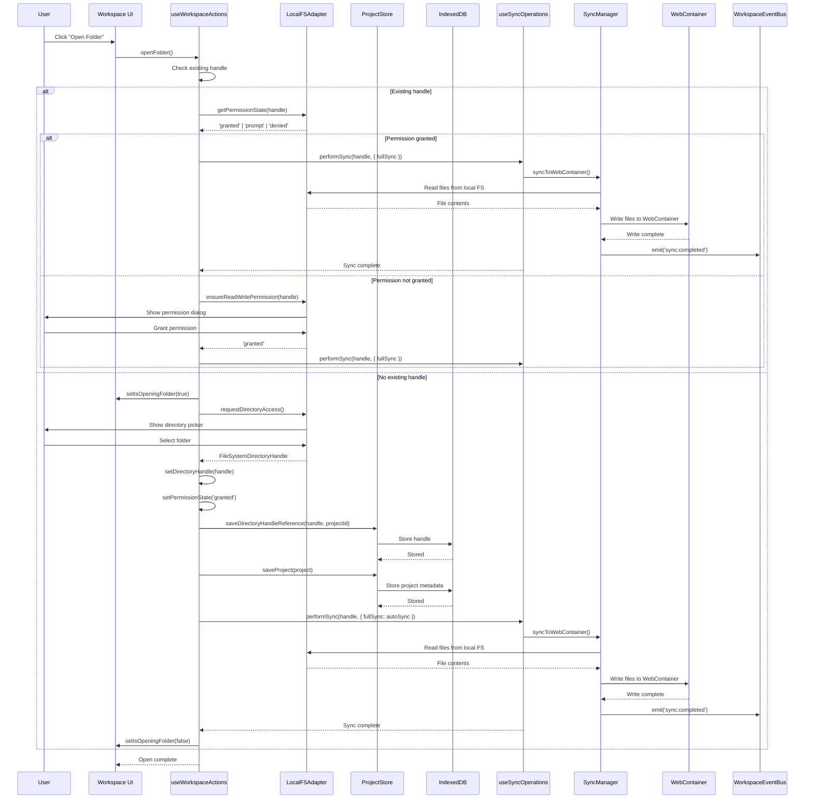
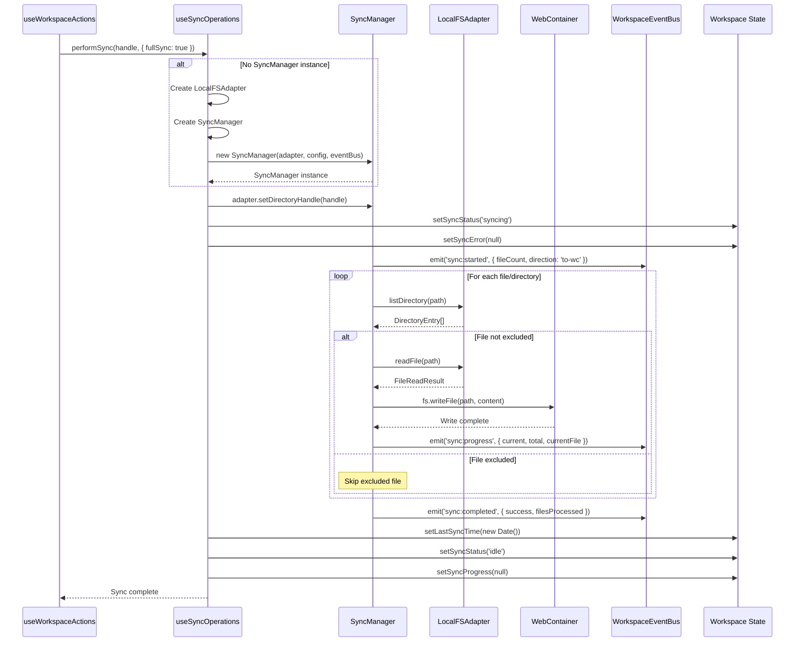
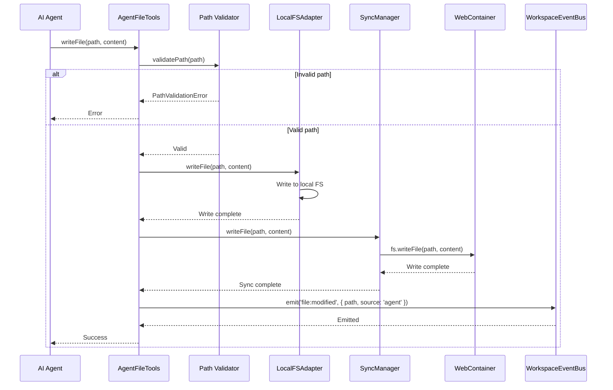
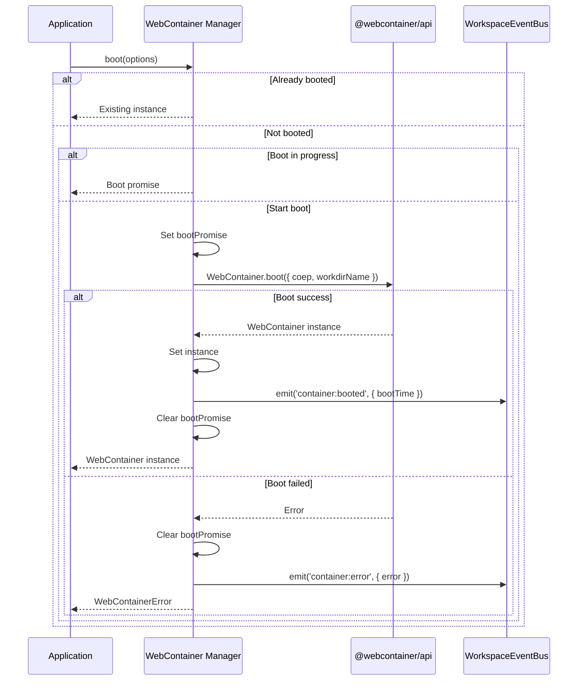
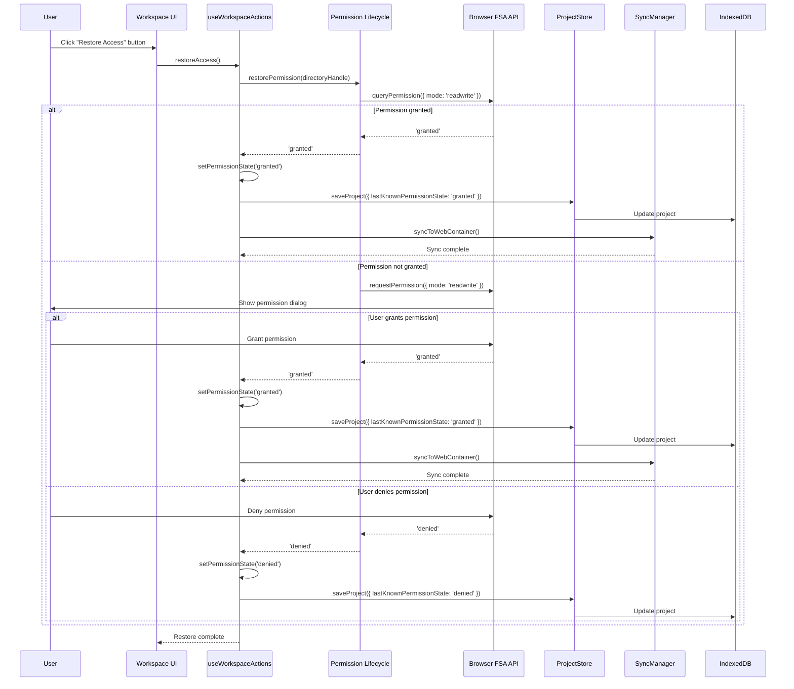
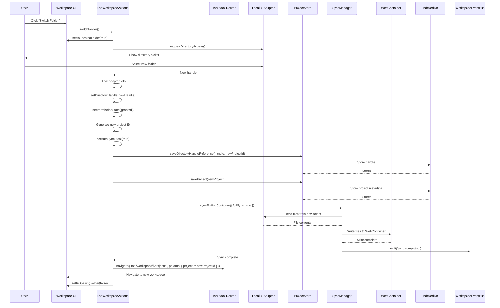
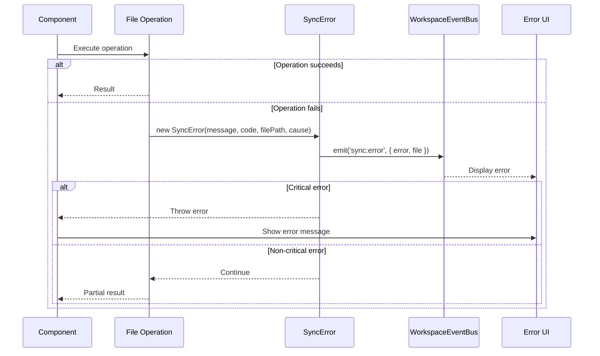
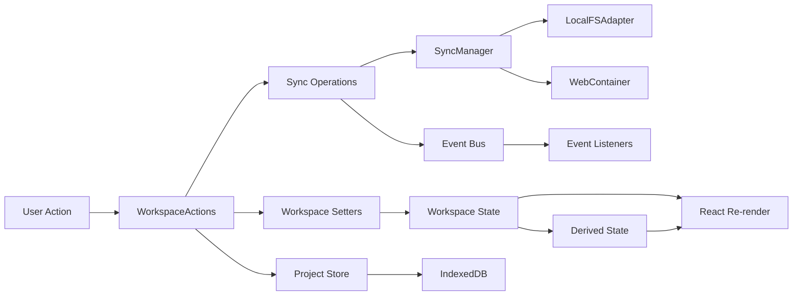

# Flows and Workflows

**Analysis Date:** 2025-12-23  
**Project:** Via-gent Browser-Based IDE  
**Purpose:** Sequence diagrams for key system workflows

---

## Table of Contents

1. [Application Initialization Flow](#application-initialization-flow)
2. [Project Open Flow](#project-open-flow)
3. [File Sync Flow](#file-sync-flow)
4. [Agent File Operation Flow](#agent-file-operation-flow)
5. [WebContainer Boot Flow](#webcontainer-boot-flow)
6. [Permission Restoration Flow](#permission-restoration-flow)
7. [Project Switch Flow](#project-switch-flow)

---

## Application Initialization Flow

**Location:** [`src/routes/__root.tsx`](../src/routes/__root.tsx)

**Key Points:**
- WebContainer boots only once (singleton pattern)
- Event bus is created before WebContainer boot
- Cross-origin isolation headers must be present for WebContainer to work
- Boot time is ~3-5 seconds

---

## Project Open Flow

**Location:** [`src/lib/workspace/hooks/useWorkspaceActions.ts`](../src/lib/workspace/hooks/useWorkspaceActions.ts:55)

**Key Points:**
- Local FS is the source of truth
- WebContainer mirrors local files (no reverse sync)
- Permission state is checked before sync
- Handle is persisted to IndexedDB for restoration

---

## File Sync Flow

**Location:** [`src/lib/workspace/hooks/useSyncOperations.ts`](../src/lib/workspace/hooks/useSyncOperations.ts:28)

**Key Points:**
- Sync is one-way: Local FS → WebContainer
- Default exclusions: `.git`, `node_modules`, `.DS_Store`, `Thumbs.db`
- Progress events are emitted for UI updates
- Partial failures don't stop the entire sync

---

## Agent File Operation Flow

**Location:** [`src/lib/agent/facades/file-tools-impl.ts`](../src/lib/agent/facades/file-tools-impl.ts)

**Key Points:**
- Agent tools validate paths before operations
- File operations go to both Local FS and WebContainer
- Events are emitted with `source: 'agent'` for tracking
- Path validation prevents directory traversal attacks

---

## WebContainer Boot Flow

**Location:** [`src/lib/webcontainer/manager.ts`](../src/lib/webcontainer/manager.ts:65)

**Key Points:**
- Singleton pattern: only one WebContainer per page
- Boot promise prevents double-booting
- Boot time is ~3-5 seconds
- Events are emitted for boot success/failure

---

## Permission Restoration Flow

**Location:** [`src/lib/filesystem/permission-lifecycle.ts`](../src/lib/filesystem/permission-lifecycle.ts:192)

**Key Points:**
- Chrome 122+ supports persistent permissions ("Allow on every visit")
- User controls when permission dialog appears
- Permission state is persisted to IndexedDB
- Sync is triggered automatically after successful restoration

---

## Project Switch Flow

**Location:** [`src/lib/workspace/hooks/useWorkspaceActions.ts`](../src/lib/workspace/hooks/useWorkspaceActions.ts:115)

**Key Points:**
- Switching folder generates a new project ID
- Old adapter refs are cleared to prevent state leakage
- WebContainer is reused (singleton)
- Navigation happens after sync completes

---

## Error Handling Flow

**Location:** [`src/lib/filesystem/sync-types.ts`](../src/lib/filesystem/sync-types.ts:43)

**Error Codes:**
- `PERMISSION_DENIED`: File system access denied
- `FILE_NOT_FOUND`: File does not exist
- `FILE_READ_FAILED`: Failed to read file
- `FILE_WRITE_FAILED`: Failed to write file
- `WEBCONTAINER_ERROR`: WebContainer operation failed
- `WEBCONTAINER_NOT_BOOTED`: WebContainer not booted
- `ENCODING_ERROR`: File encoding error
- `SYNC_FAILED`: General sync failure
- `UNKNOWN`: Unknown error

---

## Event Flow Diagram

**Location:** [`src/lib/events/workspace-events.ts`](../src/lib/events/workspace-events.ts:3)

```mermaid
graph TD
    A[File System Events] --> A1[file:created]
    A --> A2[file:modified]
    A --> A3[file:deleted]
    A --> A4[directory:created]
    A --> A5[directory:deleted]
    
    B[Sync Events] --> B1[sync:started]
    B --> B2[sync:progress]
    B --> B3[sync:completed]
    B --> B4[sync:error]
    B --> B5[sync:paused]
    B --> B6[sync:resumed]
    
    C[WebContainer Events] --> C1[container:booted]
    C --> C2[container:mounted]
    C --> C3[container:error]
    
    D[Terminal/Process Events] --> D1[process:started]
    D --> D2[process:output]
    D --> D3[process:exited]
    D --> D4[terminal:input]
    
    E[Permission Events] --> E1[permission:requested]
    E --> E2[permission:granted]
    E --> E3[permission:denied]
    E --> E4[permission:expired]
    
    F[Project Events] --> F1[project:opened]
    F --> F2[project:closed]
    F --> F3[project:switched]
    
    A1 --> G[WorkspaceEventBus]
    A2 --> G
    A3 --> G
    A4 --> G
    A5 --> G
    B1 --> G
    B2 --> G
    B3 --> G
    B4 --> G
    B5 --> G
    B6 --> G
    C1 --> G
    C2 --> G
    C3 --> G
    D1 --> G
    D2 --> G
    D3 --> G
    D4 --> G
    E1 --> G
    E2 --> G
    E3 --> G
    E4 --> G
    F1 --> G
    F2 --> G
    F3 --> G
    
    G --> H[Event Listeners]
```

---

## State Management Flow

**Location:** [`src/lib/workspace/WorkspaceContext.tsx`](../src/lib/workspace/WorkspaceContext.tsx)

---

## References

- **Workspace Actions:** [`src/lib/workspace/hooks/useWorkspaceActions.ts`](../src/lib/workspace/hooks/useWorkspaceActions.ts)
- **Sync Operations:** [`src/lib/workspace/hooks/useSyncOperations.ts`](../src/lib/workspace/hooks/useSyncOperations.ts)
- **WebContainer Manager:** [`src/lib/webcontainer/manager.ts`](../src/lib/webcontainer/manager.ts)
- **Permission Lifecycle:** [`src/lib/filesystem/permission-lifecycle.ts`](../src/lib/filesystem/permission-lifecycle.ts)
- **Event System:** [`src/lib/events/workspace-events.ts`](../src/lib/events/workspace-events.ts)
- **Agent Tools:** [`src/lib/agent/facades/file-tools.ts`](../src/lib/agent/facades/file-tools.ts)
- **Sync Manager:** [`src/lib/filesystem/sync-manager.ts`](../src/lib/filesystem/sync-manager.ts)