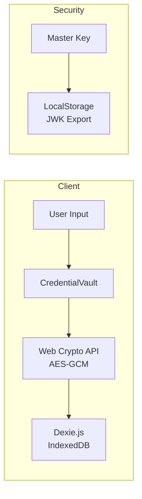
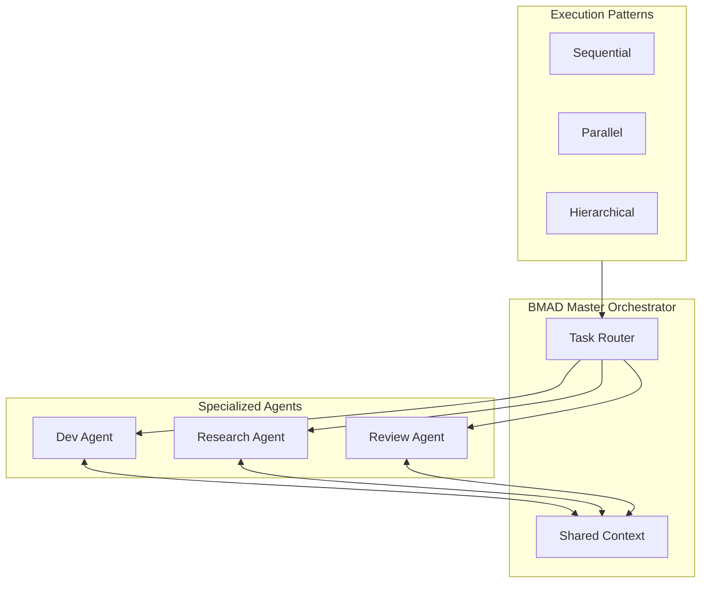
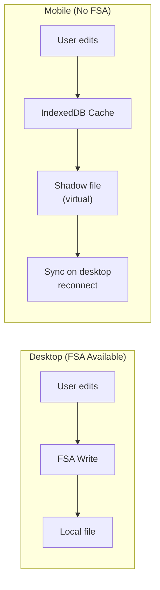

# BMAD v6 Investigation Report
## Agent Configuration, LLM Provider Integration & RAG Infrastructure

**Date**: 2025-12-28
**Phase**: Investigation & Research Cycle
**Orchestrator**: BMAD Master
**Team**: Multi-Domain Investigation

---

## Executive Summary

This report synthesizes findings from a comprehensive investigation into the Via-gent IDE architecture, covering four interconnected domains:

1. **LLM Provider Configuration System** — Current state and redesign requirements
2. **Agent Configuration Architecture** — Multi-layered agent definition framework
3. **RAG & Knowledge Synthesis Infrastructure** — Database and embedding strategies
4. **Mobile & Performance Optimization** — Client-side architecture constraints

> **Key Finding**: The existing infrastructure provides a solid foundation with `credential-vault.ts` (AES-GCM encryption), `model-registry.ts` (dynamic model fetching), and Dexie.js persistence. However, critical gaps exist in CRUD operation completion, state synchronization, and hot-load persistence.

---

## Section 1: LLM Provider Configuration System

### 1.1 Current Implementation Analysis

#### Provider Infrastructure Files

| File | Purpose | Status |
|------|---------|--------|
| [`src/lib/agent/providers/types.ts`](file:///Users/apple/Documents/coding-projects/project-alpha-master/src/lib/agent/providers/types.ts) | Provider types, configs, model definitions | ✅ Implemented |
| [`src/lib/agent/providers/credential-vault.ts`](file:///Users/apple/Documents/coding-projects/project-alpha-master/src/lib/agent/providers/credential-vault.ts) | Encrypted API key storage (AES-GCM) | ✅ Implemented |
| [`src/lib/agent/providers/model-registry.ts`](file:///Users/apple/Documents/coding-projects/project-alpha-master/src/lib/agent/providers/model-registry.ts) | Dynamic model fetching with caching | ✅ Implemented |
| [`src/lib/agent/providers/provider-adapter.ts`](file:///Users/apple/Documents/coding-projects/project-alpha-master/src/lib/agent/providers/provider-adapter.ts) | Provider adapter factory | ✅ Implemented |

#### Supported Providers

```typescript
// From src/lib/agent/providers/types.ts
export type ProviderType = 'openai' | 'openai-compatible' | 'anthropic' | 'gemini';

export const PROVIDERS: Record<string, ProviderConfig> = {
    openai: { enabled: true, supportsNativeTools: true },
    openrouter: { enabled: true, supportsNativeTools: true },
    'openai-compatible': { enabled: true, isCustom: true },
    anthropic: { enabled: false },  // Not implemented
    gemini: { enabled: false },      // Uses @tanstack/ai-gemini
};
```

#### Credential Storage Architecture



**Security Implementation**:
- **Encryption**: AES-GCM with 256-bit keys
- **Master Key Storage**: LocalStorage (JWK format) - ⚠️ Production concern
- **IV Generation**: `crypto.getRandomValues(new Uint8Array(12))`

### 1.2 Model Registry & Dynamic Fetching

```typescript
// Current implementation in model-registry.ts
const CACHE_TTL_MS = 5 * 60 * 1000; // 5 minutes

async getModels(providerId: string, apiKey?: string): Promise<ModelInfo[]> {
    // 1. Check cache
    // 2. If no API key, return defaults (FREE_MODELS)
    // 3. Fetch from provider API
    // 4. Cache and return
}
```

**Free Models (No API Key Required)**:
- `meta-llama/llama-3.1-8b-instruct:free` (131K context)
- `google/gemini-2.0-flash-exp:free` (1M context)
- `deepseek/deepseek-r1:free` (163K context)
- `deepseek/deepseek-v3:free` (131K context)

### 1.3 Critical Issues Identified

#### Issue 1: Hot-Load Persistence Failure

**Symptom**: Configuration changes don't reflect without page navigation
**Root Cause**: State updates not triggering re-renders in consuming components

**Current Flow**:
```
User edits config → Local state updated → Zustand action called → 
IndexedDB persisted → ❌ UI not updated
```

**Required Flow**:
```
User edits config → Zustand action called → IndexedDB persisted → 
✅ Zustand triggers re-render → UI updated immediately
```

#### Issue 2: CRUD Operation Gaps

| Component | Create | Read | Update | Delete | Notes |
|-----------|--------|------|--------|--------|-------|
| `AgentConfigDialog` | ✅ | ✅ | ⚠️ | ❌ | Update doesn't persist |
| `ProviderSettings` | ✅ | ✅ | ⚠️ | ❌ | Missing delete flow |
| `CustomProviderConfig` | ✅ | ✅ | ⚠️ | ⚠️ | Partial implementation |

#### Issue 3: Label/Stats Update Propagation

**Affected Components**:
- Status bar model indicator
- Agent selection store
- Chat panel provider display

**Pattern Issue**: Props drilling instead of Zustand subscription

### 1.4 Remediation Requirements

| Priority | Requirement | Effort |
|----------|-------------|--------|
| P0 | Migrate config state to Zustand with selectors | 2 days |
| P0 | Complete CRUD operations for all config types | 1 day |
| P1 | Implement hot-load via Zustand subscriptions | 1 day |
| P1 | Add credential rotation support | 0.5 day |
| P2 | Usage quota monitoring dashboard | 2 days |

---

## Section 2: Agent Configuration Architecture

### 2.1 Current Agent Definition Structure

```typescript
// From src/mocks/agents.ts and useAgents hook
interface Agent {
    id: string;
    name: string;
    role: string;           // e.g., "Code Assistant"
    model: string;          // e.g., "gemini-2.0-flash"
    provider: string;       // e.g., "OpenRouter"
    status: 'online' | 'offline' | 'busy';
    systemPrompt?: string;
    description?: string;
    temperature?: number;
}
```

### 2.2 Proposed Multi-Layer Architecture

```
┌─────────────────────────────────────────────────────────────────────────────┐
│ Layer 1: System Instruction                                                  │
│   Base identity, universal guidelines, response format                       │
├─────────────────────────────────────────────────────────────────────────────┤
│ Layer 2: Domain-Specific Instructions                                        │
│   Agentic steps, workflow guidance, task decomposition                       │
├─────────────────────────────────────────────────────────────────────────────┤
│ Layer 3: Tool Access Configuration                                           │
│   Domain tools (exclusive), General tool pool (shared), Permissions         │
├─────────────────────────────────────────────────────────────────────────────┤
│ Layer 4: Custom Role Definition                                              │
│   User-defined role specs → Pinned to every API request                      │
├─────────────────────────────────────────────────────────────────────────────┤
│ Layer 5: Custom Instruction Input                                            │
│   User instructions → Hidden context injection                               │
└─────────────────────────────────────────────────────────────────────────────┘
```

### 2.3 Tool Registry Architecture

**Current Tools** (`src/lib/agent/tools/`):
- `read-file.ts` - File reading via FSA
- `write-file.ts` - File writing with sync
- `list-files.ts` - Directory listing
- `execute-command.ts` - Terminal execution
- `search-files.ts` - Content search

**Proposed Tool Categories**:

| Category | Tools | Access Level |
|----------|-------|--------------|
| Filesystem | read, write, list, search | General Pool |
| Terminal | execute, shell | General Pool |
| Code Analysis | ast-parse, lint, format | Domain: Dev |
| Web Research | fetch, scrape, search | Domain: Research |
| Knowledge | embed, retrieve, synthesize | Domain: RAG |

### 2.4 Multi-Agent Orchestration Design



**Orchestration Patterns**:
1. **Sequential**: Agent A → Agent B → Agent C
2. **Parallel**: Agent A | Agent B | Agent C → Merge
3. **Hierarchical**: Master → Workers → Report back

### 2.5 Conversation Thread Management

**Current Implementation** (`src/lib/state/dexie-db.ts`):

```typescript
interface ConversationThreadRecord {
    id: string;
    projectId: string;
    title: string;
    preview: string;
    messages: ThreadMessageRecord[];
    agentsUsed: string[];
    messageCount: number;
    createdAt: number;
    updatedAt: number;
}
```

**Indexing Strategy**:
- Primary: `id`
- Secondary: `projectId`, `createdAt`
- Full-text: `title`, `preview` (future via Dexie full-text addon)

### 2.6 State Architecture Issues

**Current Pattern** (from `IDELayout.tsx` audit):
```typescript
// ❌ Dual-source state management
const openFilePaths = useIDEStore((s) => s.openFiles);  // Zustand
const [fileContentCache, setFileContentCache] = useState<Map>(); // Local

// ❌ Custom sync function duplicating Zustand logic
const setOpenFiles = (filesOrUpdater) => { ... };
```

**Required Pattern**:
```typescript
// ✅ Single source of truth
const { openFiles, addOpenFile, removeOpenFile } = useIDEStore();
const [fileContentCache, setFileContentCache] = useState<Map>(); // Ephemeral only
```

---

## Section 3: RAG & Knowledge Synthesis Infrastructure

### 3.1 Database Strategy Research

| Use Case | Recommended Technology | Rationale |
|----------|----------------------|-----------|
| **Vector Storage** | Dexie.js + ONNX embeddings | Client-side, offline-first |
| **Document Storage** | Dexie.js `documents` table | Already implemented |
| **Metadata Index** | Dexie.js compound indexes | Native support |
| **Context Cache** | In-memory Map + LRU | Fast retrieval |

**Alternative Considerations**:
- **SQLite-WASM**: For complex queries (future)
- **LanceDB**: Vector-native (requires WASM build)

### 3.2 Embedding Model Research

#### Local Embedding Options

| Model | Size | Dimensions | Performance |
|-------|------|------------|-------------|
| **all-MiniLM-L6-v2** | 23MB | 384 | Fast, good quality |
| **BGE-small-en-v1.5** | 33MB | 384 | Higher quality |
| **Nomic-embed-text** | 137MB | 768 | Best quality, slower |

**Recommended**: `all-MiniLM-L6-v2` via ONNX Runtime Web
- WASM backend for browser compatibility
- WebGL acceleration where available

#### TanStack AI Gemini Integration

```typescript
// From @tanstack/ai-gemini docs
import { chat, toolDefinition } from "@tanstack/ai";
import { geminiText } from "@tanstack/ai-gemini";

const stream = chat({
  adapter: geminiText("gemini-2.5-pro"),
  messages,
  tools: [myTool],
});
```

### 3.3 Chunking Strategy Framework

| Content Type | Strategy | Chunk Size | Overlap |
|--------------|----------|------------|---------|
| **Technical Docs** | Semantic (by sections) | 512-1024 tokens | 50 tokens |
| **Conversational** | Sliding window | 2048-4096 tokens | 100 tokens |
| **Long-form Articles** | Hierarchical (H1→H2→P) | 1024-2048 tokens | 50 tokens |
| **Structured Data** | Record-based | Variable | N/A |

### 3.4 Knowledge Synthesis Center Integration

**Reference**: `_bmad-output/cis/knowledge-synthesis-station-concept-2025-12-26.md`

**Core Architecture**:
```
┌─────────────────────────────────────────────────────────────────┐
│ INPUT LAYER                                                      │
│   PDF, URLs, YouTube, Audio, Text                                │
├─────────────────────────────────────────────────────────────────┤
│ SYNTHESIS ENGINE                                                 │
│   AI Processing → Concept Extraction → Connection Mapping        │
├─────────────────────────────────────────────────────────────────┤
│ OUTPUT LAYER                                                     │
│   Visual Canvas, Audio Overview, Flashcards, Quizzes            │
└─────────────────────────────────────────────────────────────────┘
```

**Existing Infrastructure to Reuse**:
- TanStack Start/Router → Routing
- IndexedDB (Dexie) → Local persistence
- TanStack AI + Gemini → AI chat
- Monaco Editor → Rich text editing
- i18next → Vietnamese i18n

### 3.5 Multi-Modal RAG Capabilities

**Gemini API Capabilities** (from Context7 research):

| Modality | Input | Output | API Endpoint |
|----------|-------|--------|--------------|
| Text | ✅ | ✅ | `generateContent` |
| Image | ✅ | ✅ | `generateContent` + Imagen |
| Audio | ✅ | ✅ | Live API (WebSocket) |
| Video | ✅ | ❌ | `generateContent` |

**Live API for Audio**:
```javascript
// Real-time bidirectional audio streaming
const liveConnection = await client.live.connect({
    model: 'gemini-live-2.5-flash-preview',
    config: { responseModalities: ['audio'] }
});

// Send audio as PCM chunks
liveConnection.send({ audio: base64AudioChunk });
```

---

## Section 4: Mobile & Performance Optimization

### 4.1 Mobile Architecture Constraints

| API | Desktop | Mobile Safari | Mobile Chrome |
|-----|---------|---------------|---------------|
| **File System Access** | ✅ Full | ❌ Not supported | ⚠️ Partial (Android) |
| **WebContainers** | ✅ Full | ❌ Not supported | ❌ Not supported |
| **IndexedDB** | ✅ Full | ✅ Full | ✅ Full |
| **Web Crypto** | ✅ Full | ✅ Full | ✅ Full |
| **Service Workers** | ✅ Full | ⚠️ Limited | ✅ Full |

### 4.2 Current Mobile Status

**From Sprint Change Proposal** (`_bmad-output/sprint-change-proposal-2025-12-28.md`):

- `MinViewportWarning.tsx` blocks access below 1024px
- MRT (Mobile Responsive Transformation) epic in progress
- Stories MRT-1 through MRT-4 completed
- MRT-5 (Monaco Mobile Optimization) next

### 4.3 Progressive Enhancement Strategy

```
┌─────────────────────────────────────────────────────────────────┐
│ Tier 1: Full Desktop Experience (≥1024px)                       │
│   All features, multi-pane layout, WebContainers                │
├─────────────────────────────────────────────────────────────────┤
│ Tier 2: Tablet Experience (768px - 1023px)                      │
│   Adapted layout, full features except WebContainers            │
├─────────────────────────────────────────────────────────────────┤
│ Tier 3: Mobile Experience (≥375px)                              │
│   Single-pane, demo mode, pre-loaded templates                  │
│   Chat + viewing only (no file editing)                         │
└─────────────────────────────────────────────────────────────────┘
```

### 4.4 Shadow File Caching Strategy



### 4.5 Performance Optimization Targets

| Metric | Current | Target | Strategy |
|--------|---------|--------|----------|
| **First Contentful Paint** | ~2.5s | <1.5s | Code splitting, preload |
| **Time to Interactive** | ~4.0s | <2.5s | Lazy load editors |
| **Memory (Mobile)** | ~150MB | <100MB | Aggressive cleanup |
| **Bundle Size** | ~2.1MB | <1.5MB | Tree shaking, dynamic imports |

---

## Section 5: Gemini API Integration Specifics

### 5.1 Model Capability Mapping

| Model | Context | Tools | Streaming | Multi-modal |
|-------|---------|-------|-----------|-------------|
| `gemini-2.5-pro` | 1M | ✅ | ✅ | ✅ |
| `gemini-2.5-flash` | 1M | ✅ | ✅ | ✅ |
| `gemini-2.0-flash-exp` | 1M | ✅ | ✅ | ✅ |
| `gemini-live-*` | Session | ✅ | WebSocket | Audio/Video |

### 5.2 Tool Calling Pattern

```typescript
// Gemini native tool calling (from API docs)
const toolConfig = {
  functionDeclarations: [{
    name: 'get_weather',
    description: 'Gets weather for a location',
    parameters: {
      type: 'OBJECT',
      properties: {
        location: { type: 'STRING', description: 'City name' }
      },
      required: ['location']
    }
  }]
};

const response = await client.models.generateContent({
  model: 'gemini-2.5-flash',
  contents: prompt,
  config: { tools: [toolConfig] }
});
```

### 5.3 TanStack AI Integration Pattern

```typescript
// Recommended pattern for Via-gent
import { chat, toolDefinition } from "@tanstack/ai";
import { geminiText } from "@tanstack/ai-gemini";
import { z } from "zod";

// Define tool with Zod schema
const readFileTool = toolDefinition({
  name: "read_file",
  description: "Read file contents from workspace",
  inputSchema: z.object({
    path: z.string().describe("File path relative to workspace root")
  })
});

// Server implementation
const readFile = readFileTool.server(async ({ path }) => {
  // Implementation using FSA or sync manager
  return { content: await readFileFromWorkspace(path) };
});

// Chat with tools
const stream = chat({
  adapter: geminiText("gemini-2.5-flash"),
  messages,
  tools: [readFile]
});
```

### 5.4 Error Handling Strategy

| Error Type | HTTP Code | Retry Strategy |
|------------|-----------|----------------|
| Rate Limit | 429 | Exponential backoff (max 3) |
| Server Error | 5xx | Immediate retry (max 2) |
| Invalid Request | 400 | No retry, surface to user |
| Auth Error | 401/403 | Prompt for new API key |

---

## Section 6: Recommended Epic Remediation

### Epic 25: AI Foundation Sprint (Enhanced)

| Story | Title | Priority | Effort |
|-------|-------|----------|--------|
| 25-1 | Migrate provider config to Zustand | P0 | 2d |
| 25-2 | Complete CRUD for all config types | P0 | 1d |
| 25-3 | Hot-load configuration changes | P0 | 1d |
| 25-4 | Gemini native tool calling | P1 | 2d |
| 25-5 | TanStack AI Gemini adapter | P1 | 1.5d |

### Epic 29: State Management Consolidation

| Story | Title | Priority | Effort |
|-------|-------|----------|--------|
| 29-1 | Eliminate IDELayout state duplication | P0 | 1d |
| 29-2 | Consolidate MobileIDELayout state | P0 | 0.5d |
| 29-3 | Provider service layer | P1 | 2d |

### Epic 30: Knowledge Synthesis Station

| Story | Title | Priority | Effort |
|-------|-------|----------|--------|
| 30-1 | Source upload and processing | P0 | 2d |
| 30-2 | Local embedding with ONNX | P1 | 3d |
| 30-3 | Visual knowledge canvas | P1 | 3d |
| 30-4 | Audio overview generation | P2 | 2d |

---

## Appendix A: File References

### Core Provider Infrastructure
- [`src/lib/agent/providers/types.ts`](file:///Users/apple/Documents/coding-projects/project-alpha-master/src/lib/agent/providers/types.ts)
- [`src/lib/agent/providers/credential-vault.ts`](file:///Users/apple/Documents/coding-projects/project-alpha-master/src/lib/agent/providers/credential-vault.ts)
- [`src/lib/agent/providers/model-registry.ts`](file:///Users/apple/Documents/coding-projects/project-alpha-master/src/lib/agent/providers/model-registry.ts)

### State Management
- [`src/lib/state/dexie-db.ts`](file:///Users/apple/Documents/coding-projects/project-alpha-master/src/lib/state/dexie-db.ts)
- [`src/lib/state/ide-store.ts`](file:///Users/apple/Documents/coding-projects/project-alpha-master/src/lib/state/ide-store.ts)

### Agent UI Components
- [`src/components/ide/AgentsPanel.tsx`](file:///Users/apple/Documents/coding-projects/project-alpha-master/src/components/ide/AgentsPanel.tsx)
- [`src/routes/agents.tsx`](file:///Users/apple/Documents/coding-projects/project-alpha-master/src/routes/agents.tsx)

### Reference Documents
- [`_bmad-output/team-b/state-management-requirements-2025-12-27.md`](file:///Users/apple/Documents/coding-projects/project-alpha-master/_bmad-output/team-b/state-management-requirements-2025-12-27.md)
- [`_bmad-output/cis/knowledge-synthesis-station-concept-2025-12-26.md`](file:///Users/apple/Documents/coding-projects/project-alpha-master/_bmad-output/cis/knowledge-synthesis-station-concept-2025-12-26.md)

---

## Appendix B: External Documentation Links

### Gemini API
- [Function Calling](https://ai.google.dev/gemini-api/docs/function-calling)
- [Live API](https://ai.google.dev/gemini-api/docs/live)
- [Embeddings](https://ai.google.dev/gemini-api/docs/embeddings)
- [Models](https://ai.google.dev/gemini-api/docs/models)

### TanStack AI
- [Gemini Adapter](https://tanstack.com/ai/latest/docs/adapters/gemini)
- [Tool Definitions](https://tanstack.com/ai/latest/docs/concepts/tools)

---

*Generated via BMAD v6 Investigation Cycle - 2025-12-28*
*Orchestrated by: BMAD Master Agent*
