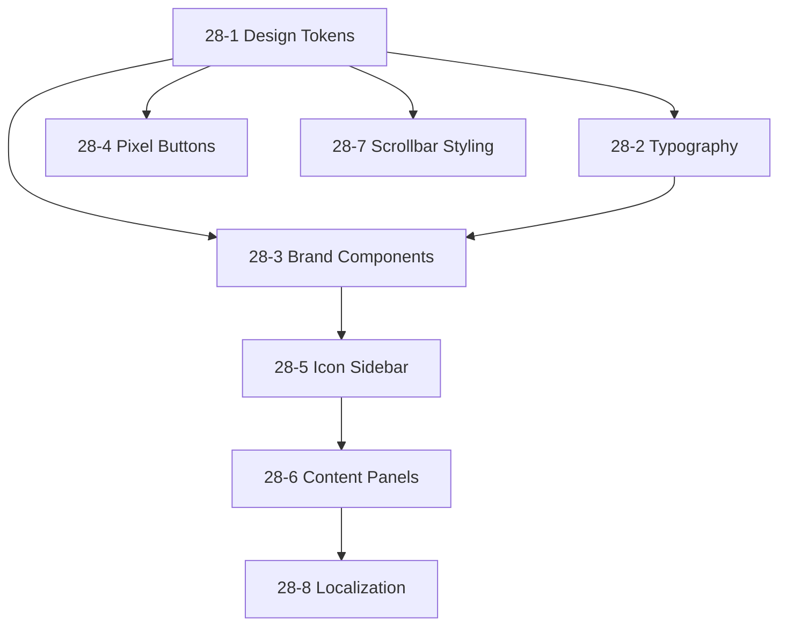

# UX/UI Modernization: Via-Gent Brand Identity & Design System

**Goal:** Transform the current half-baked IDE interfaces into a refined, premium agentic experience inspired by MistralAI's 8-bit gaming aesthetic, establishing a consistent design system with TailwindCSS + ShadcnUI, dark theme default, and full EN/VI localization.

---

## User Review Required

> [!IMPORTANT]
> **Course Correction Decision**: This plan proposes creating **Epic 28: UX Brand Identity & Design System** as a new epic focused on foundational styling/branding, rather than extending Epic 23 further. Epic 23 already has 16 stories and is mid-execution. Epic 28 establishes the design foundation that Epic 23's remaining stories will consume.

> [!WARNING]
> **Breaking Change**: The 8-bit pixel aesthetic (VT323/Press Start 2P fonts, pixel shadows, squared borders) is a significant departure from the current generic ShadcnUI defaults. All components will need to adopt the new design tokens.

---

## Analysis Summary

### Current State Assessment

| Aspect | Current | Target |
|--------|---------|--------|
| **Epic 23** | 5/16 stories done (23-1 to 23-5) | Stories 23-6 to 23-16 pending |
| **Design System** | Generic ShadcnUI defaults | 8-bit gaming aesthetic |
| **Branding** | No consistent identity | VIA-GENT pixel brand |
| **Typography** | Inter only | Inter + JetBrains Mono + VT323/Press Start 2P |
| **Theme** | Basic dark mode | Premium dark with pixel accents |
| **Localization** | Partial (EN/VI keys exist) | Full coverage |
| **IDE Layout** | Fixed, cramped panels | Collapsible sidebar, resizable panels |

### UI Concept Mockups Analyzed

Your 9 HTML mockups in `_bmad-output/unified_ide_workspace_ux_ui/` establish:

1. **Color Palette**:
   - Primary: `#f97316` (Orange accent)
   - Background: `#0f0f11` (Deep black)
   - Surface: `#18181b` (Panel background)
   - Editor: `#09090b` (Code editor)

2. **8-Bit Aesthetic**:
   - Font: VT323 or "Press Start 2P" for headings/branding
   - Pixel shadows: `2px 2px 0px 0px rgba(0,0,0,0.5)`
   - Squared borders (rounded-none or rounded-sm)
   - Retro UI elements (scanlines, dot patterns)

3. **Key Interfaces**:
   - Collapsible icon sidebar (48px collapsed, 280px expanded)
   - Agent Management Dashboard with metrics cards
   - Agent Configuration Forms with LLM provider selection
   - Rich Agent Chat with tool execution logs
   - Terminal integration with vim-like prompt

---

## Proposed Changes

### Epic 28: UX Brand Identity & Design System

**Priority:** P0 | **Stories:** 8 | **Points:** 34 | **Duration:** 1-2 weeks

This epic establishes the foundational design system that all other UI work will build upon.

---

#### [NEW] [design-tokens.css](file:///c:/Users/Admin/Documents/coding-project/project-alpha-master/project-alpha-master/src/styles/design-tokens.css)

Core CSS design tokens for the 8-bit aesthetic:
- Color tokens (primary, background, surface, accent)
- Typography tokens (font-pixel, font-mono)
- Shadow tokens (pixel-shadow variants)
- Border tokens (squared corners)

#### [MODIFY] [tailwind.config.ts](file:///c:/Users/Admin/Documents/coding-project/project-alpha-master/project-alpha-master/tailwind.config.ts)

Extend Tailwind with:
- 8-bit color palette
- Pixel font families (VT323, Press Start 2P)
- Pixel shadow utilities
- Custom border-radius (squared)

#### [MODIFY] [globals.css](file:///c:/Users/Admin/Documents/coding-project/project-alpha-master/project-alpha-master/src/styles/globals.css)

Apply design tokens:
- Custom scrollbar styling
- Selection highlighting
- Base font settings
- Dark mode as default

---

### Component Library Updates

#### [MODIFY] [button.tsx](file:///c:/Users/Admin/Documents/coding-project/project-alpha-master/project-alpha-master/src/components/ui/button.tsx)

Add new button variants:
- `pixel`: 8-bit aesthetic with pixel shadow
- `pixel-primary`: Orange accent with shadow

#### [NEW] [brand-logo.tsx](file:///c:/Users/Admin/Documents/coding-project/project-alpha-master/project-alpha-master/src/components/ui/brand-logo.tsx)

VIA-GENT brand component:
- Pixel "V" logo in orange square
- VIA-GENT text in pixel font
- Support for light/dark modes

#### [NEW] [pixel-badge.tsx](file:///c:/Users/Admin/Documents/coding-project/project-alpha-master/project-alpha-master/src/components/ui/pixel-badge.tsx)

Status badges with 8-bit styling:
- SYSTEM ONLINE / OFFLINE
- Agent status indicators
- Retro color schemes

---

### IDE Layout Enhancements

#### [MODIFY] [IDELayout.tsx](file:///c:/Users/Admin/Documents/coding-project/project-alpha-master/project-alpha-master/src/components/layout/IDELayout.tsx)

Refactor to support:
- Collapsible icon sidebar (48px → 280px)
- Dynamic content panels
- Keyboard shortcuts for panel toggling
- Smooth transitions

#### [NEW] [IconSidebar.tsx](file:///c:/Users/Admin/Documents/coding-project/project-alpha-master/project-alpha-master/src/components/ide/IconSidebar.tsx)

VS Code-style activity bar:
- Files, Search, Agents, Git, Settings icons
- Tooltip with keyboard shortcuts
- Badge notifications
- Collapsible state management

#### [NEW] [ContentPanel.tsx](file:///c:/Users/Admin/Documents/coding-project/project-alpha-master/project-alpha-master/src/components/ide/ContentPanel.tsx)

Dynamic panel container:
- File Explorer view
- Search view
- Agent Management view
- Git view
- Settings view

---

### Localization Infrastructure

#### [MODIFY] [en.json](file:///c:/Users/Admin/Documents/coding-project/project-alpha-master/project-alpha-master/src/i18n/locales/en.json)

Add missing keys for:
- Agent management UI
- Configuration forms
- Tool registry
- System status messages

#### [MODIFY] [vi.json](file:///c:/Users/Admin/Documents/coding-project/project-alpha-master/project-alpha-master/src/i18n/locales/vi.json)

Vietnamese translations for all new keys

---

## Story Breakdown: Epic 28

| Story | Title | Points | Priority |
|-------|-------|--------|----------|
| 28-1 | Establish Design Token System | 3 | P0 |
| 28-2 | Configure 8-Bit Typography | 2 | P0 |
| 28-3 | Create Brand Components (Logo, Badge) | 3 | P0 |
| 28-4 | Implement Pixel Button Variants | 2 | P1 |
| 28-5 | Build Collapsible Icon Sidebar | 5 | P0 |
| 28-6 | Create Dynamic Content Panels | 5 | P0 |
| 28-7 | Update All Scrollbar Styling | 2 | P1 |
| 28-8 | Complete Localization Coverage (EN/VI) | 5 | P1 |

**Total: 27 points** (~1.5-2 weeks at current velocity)

---

## Verification Plan

### Automated Tests

```bash
# Run existing test suite to verify no regressions
pnpm test

# Verify Tailwind CSS compilation with new tokens
pnpm build

# Screenshot comparison for UI components
pnpm test:e2e
```

### Manual Verification

1. **Visual Verification**:
   - Compare implemented components against mockups in `_bmad-output/unified_ide_workspace_ux_ui/`
   - Verify pixel font rendering at various sizes
   - Check dark theme consistency across all panels

2. **Interaction Testing**:
   - Sidebar collapse/expand animation smoothness
   - Panel switching keyboard shortcuts work
   - Tooltip hover states display correctly

3. **Localization Testing**:
   - Switch between EN/VI in header
   - Verify all new strings render correctly in both languages
   - Check for text overflow in Vietnamese translations

---

## Dependency Graph



---

## Integration with Epic 23

After Epic 28 completes, Epic 23's remaining stories (23-6 through 23-16) will:

1. **Consume the design tokens** from 28-1
2. **Use brand components** from 28-3
3. **Extend the collapsible sidebar** from 28-5 with agent-specific panels
4. **Add localization** keys following patterns from 28-8

This creates a clean foundation → feature relationship.

---

## Files Changed Summary

| Category | New | Modified |
|----------|-----|----------|
| Styles | 1 | 2 |
| Components | 4 | 3 |
| Localization | 0 | 2 |
| Config | 0 | 1 |
| **Total** | **5** | **8** |
